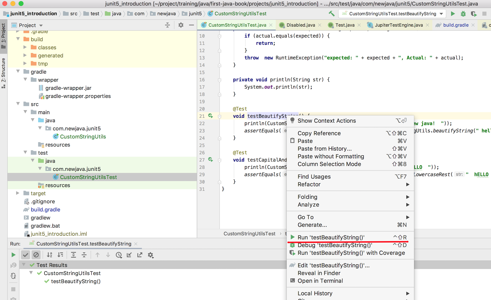
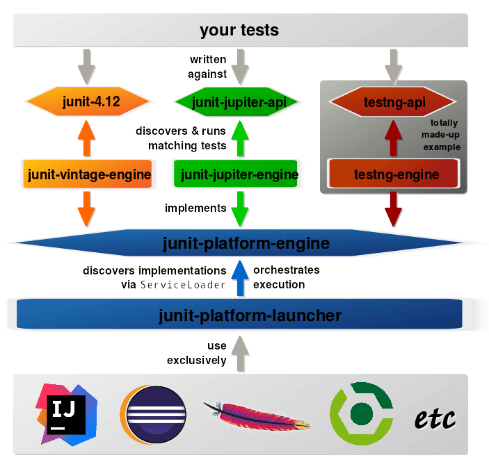

# 第1节：Junit5入门

对于使用过Ruby、Javascript、NodeJS、Python、Scala等语言的程序员来说，交互式工具应该已成为日常必备，这里拿NodeJS的交互式工具作为例子：

```javascript
⇒  node
> "hello world, nodejs".replace(" ", ",")
'hello,world, nodejs'
> const add = (a, b) => a + b;
undefined
> add(1, 2)
3
>
```

安装好NodeJS后，命令行就可以调用`node`命令打开命令行交互式工具，在这个工具里，就可以快速直观的验证各种表达式。

在Java9之前，Java是没有命令行交互式工具的。那么Java程序员一般是怎么来验证一些表达式或验证自己代码的一些初步想法呢？直观的想法是在类中使用`main`函数，以及自行调用`System.out.println`:

```java
package com.newjava.junit5;

import java.util.Objects;
public class CustomStringUtils {

    public static String beautifyString(final String str) {
        Objects.requireNonNull(str);
        return str.replaceAll("\\s+", " ").trim();
    }

    public static String capitalAndLowercaseRest(final String str) {
        Objects.requireNonNull(str);
        String trimmedStr = str.trim();
        return trimmedStr.length() <  2
                ? trimmedStr.toUpperCase()
                : trimmedStr.substring(0, 1).toUpperCase() + trimmedStr.substring(1).toLowerCase();
    }

    public static void main(String[] args) {
        // test beautifyString
        System.out.println(beautifyString(" hello  world,  new java!  "));

        // test capitalAndLowercaseRest
        System.out.println(capitalAndLowercaseRest("  hELLO  "));
    }
}
```

很多Java初学者，以及一些Java程序员因此而养成了在很多类里添加`main`函数的习惯，等到这个类的代码开发工作基本完成，再把这个`main`函数删除掉。

这种方式有一些显而易见的问题：

- 一个Java类只能有一个`main`函数，开发人员开发过程的中间测试代码都只能放在这一个`main`函数里。
- 每次运行完main后，需要一个一个去人肉比对结果是否符合预期。

- `main`函数中的测试代码作为中间代码最终会被清除掉，尽管有些中间测试代码是有保留价值的，除了主类的`main`函数，其他类的`main`函数是不被建议正式提交到代码库的。
- `main`很难保留足够测试场景，`CustomStringUtils`如何有十几个方法，应该不会有哪个程序员在开发过程中保留这十几个方法的中间测试代码。
- 如果代码后续遇到线上问题，调试代码可能又要临时添加`main`方法，如果类的构造复杂度高的话，又需要重新在`main`方法里构造类的实例进行测试，效率很低。

  Junit5单元测试框架针对这些问题提供了一套解决方案，让我们先来看看Junit5在代码上是如何解决这个问题的：

```java
package com.newjava.junit5;

import org.junit.jupiter.api.Test;
import static com.newjava.junit5.CustomStringUtils.beautifyString;
import static com.newjava.junit5.CustomStringUtils.capitalAndLowercaseRest;
import static org.junit.jupiter.api.Assertions.assertEquals;
class CustomStringUtilsTest {
  
  	private void println(String str) {
        System.out.println(str);
    }
    @Test
    void testBeautifyString() {
        println(beautifyString(" hello  world,  new java!  ")); //需要删除的语句，仅为演示
        assertEquals("hello world, new java!", beautifyString(" hello  world,  new java!  "));
    }

    @Test
    void testCapitalAndLowercaseRest() {
      	println(capitalAndLowercaseRest("  hELLO  ")); //需要删除的语句，仅为演示
        assertEquals("Hello", capitalAndLowercaseRest("  hELLO  "));
    }
}
```

这里面包含的知识点：

- 测试代码`CustomStringUtilsTest`与实现代码`CustomStringUtils`分离，以后应用代码打包就可以将测试代码排除了。

- 测试类的每个测试方法（带有注解`@Test`的方法）都可以看做一个独立的`main`函数，与IDE配合，每个测试方法都像`main`方法一样，可以独立运行。

- 每个测试方法名可以用来描述测试目的，可以使用驼峰式的命名，也可以使用下划线方式，如`test_beautify_string`，也可以驼峰和下划线并用的方式命名方法。当然，如果希望自然语言来描述测试用例，可以使用注解`@DisplayName`，具体使用的例子在后续章节有介绍。

- 测试类中可以定义测试帮助方法，如`println`。

- 测试方法可以自己判断代码是否如期运行，`assertEquals`断言就实现了这种功能。Junit5作为一个单元测试框架，提供了很多`断言`的实现，后面的章节我们会介绍更多的章节。而这里我们其实可以简单自定义一个简单的断言函数来对`断言`有一个直观的认知：

  ```java
  private void customAssertEquals(String expected, String actual) {
    if (actual.equals(expected)) {
      return;
    }
    throw  new RuntimeException("expected: " + expected + ", Actual: " + actual);
  }
  ```

  如果实际结果与期望结果不一致，我们就抛出`RuntimeException`异常来提醒开发者。

> 建议经常使用Junit5提供的断言，断言能够自动对结果进行检查。而System.out.println还需要开发者自己手动去比对。

## 命令行运行单元测试

关于上面的`CustomStringUtils`和`CustomStringUtilsTest`所在Java项目的目录结构：

```shell
├── lib
│   ├── junit-jupiter-api-5.6.0.jar
│   └── junit-platform-console-standalone-1.6.0.jar
└── src
    ├── main
    │   └── java
    │       └── com
    │           └── newjava
    │               └── junit5
    │                   └── CustomStringUtils.java
    └── test
        └── java
            └── com
                └── newjava
                    └── junit5
                        └── CustomStringUtilsTest.java
```

> [junit-jupiter-api-5.6.0.jar](https://repo1.maven.org/maven2/org/junit/jupiter/junit-jupiter-api/5.6.0/)和[junit-platform-console-standalone-1.6.0.jar](https://repo1.maven.org/maven2/org/junit/platform/junit-platform-console-standalone/1.6.0/)都可以在Maven仓库中下载。

最原始的方式是通过在命令行下手动编译Java类：

```shell
mkdir -p build/main
mkdir -p build/test

//编译CustomStringUtils.java文件，依赖junit-jupiter-api-5.6.0.jar
javac -classpath lib/junit-jupiter-api-5.6.0.jar -d build/test src/test/java/com/newjava/junit5/CustomStringUtilsTest.java

//编译CustomStringUtilsTest.java文件
javac -classpath lib/junit-jupiter-api-5.6.0.jar:build/main/ -d build/test src/test/java/com/newjava/junit5/CustomStringUtilsTest.java
```

而后在命令行运行单元测试，`junit-platform-console-standalone-1.6.0.jar`是Junit5为了支持在命令行执行单元测试而提供的Jar包，其类入口为[ConsoleLauncher](https://junit.org/junit5/docs/current/api/org.junit.platform.console/org/junit/platform/console/ConsoleLauncher.html)：

```shell
⇒  java -jar lib/junit-platform-console-standalone-1.6.0.jar -cp 'build/main;build/test' -select-class com.newjava.junit5.CustomStringUtilsTest
hello world, new java!
Hello

Thanks for using JUnit! Support its development at https://junit.org/sponsoring

╷
├─ JUnit Jupiter ✔
│  └─ CustomStringUtilsTest ✔
│     ├─ testBeautifyString() ✔
│     └─ testCapitalAndLowercaseRest() ✔
└─ JUnit Vintage ✔

Test run finished after 99 ms
[         3 containers found      ]
[         0 containers skipped    ]
[         3 containers started    ]
[         0 containers aborted    ]
[         3 containers successful ]
[         0 containers failed     ]
[         2 tests found           ]
[         0 tests skipped         ]
[         2 tests started         ]
[         0 tests aborted         ]
[         2 tests successful      ]
[         0 tests failed          ]

```

上面的命令行结果可以看到运行了两个测试，两个测试用例都测试通过。如果想运行一个包下的所有测试用例：

```shell
java -jar lib/junit-platform-console-standalone-1.6.0.jar -cp 'build/main;build/test' -select-package com.newjava.junit5
```

只运行测试类下的某一个测试：

```shell
java -jar lib/junit-platform-console-standalone-1.6.0.jar -cp 'build/main;build/test' -select-method com.newjava.junit5.CustomStringUtilsTest#testBeautifyString
```

## 使用构建工具来运行单元测试

在上面所展示目录的基础上，可以使用`Gradle`或`Maven`这两个中的任意一个build工具来对项目进行构建、测试、打包的管理。

- 在使用`Gradle`项目中，`build.gradle`中的关键部分:

  ```groovy
  dependencies {
  		//JUnit Jupiter API 提供了注解和断言的实现
      testImplementation 'org.junit.jupiter:junit-jupiter-api:5.4.2'
      
      //JUnit Jupiter Test Engine实现了TestEngine接口，用于发现和执行Junit5单元测试用例，
      testRuntimeOnly 'org.junit.jupiter:junit-jupiter-engine:5.4.2'
  }
  test {
      useJUnitPlatform()
  }
  ```

  在使用`Gradle`构建的项目中，使用`gradle test`命令就可以执行所有单元测试用例了。

  在`build.gradle`中，可以通过在`test`节点中设置`excludes`的方式来排除对某些测试类的执行：

  ```groovy
  test {
      exclude 'com/newjava/junit5/CustomStringUtilsTest.class'
      useJUnitPlatform()
  }
  ```

  也可以通过Junit5的打标签（基于`@Tag`注解）的方式来确定测试范围，后面的章节在介绍这部分功能。

  > 关于Gradle的使用在第四章有详细介绍

- 在使用`Maven`项目中，`pom.xml`中的关键部分:

  ```xml
  <build>
      <plugins>
          <plugin>
              <artifactId>maven-surefire-plugin</artifactId>
              <version>2.22.2</version>
          </plugin>
          <plugin>
              <artifactId>maven-failsafe-plugin</artifactId>
              <version>2.22.2</version>
          </plugin>
      </plugins>
  </build>
  <dependencies>
      <dependency>
          <groupId>org.junit.jupiter</groupId>
          <artifactId>junit-jupiter-api</artifactId>
          <version>5.6.0</version>
          <scope>test</scope>
      </dependency>
      <dependency>
          <groupId>org.junit.jupiter</groupId>
          <artifactId>junit-jupiter-engine</artifactId>
          <version>5.6.0</version>
          <scope>test</scope>
      </dependency>
  </dependencies>
  ```

  在使用`Maven`构建的项目中，使用`mvn test`命令就可以执行所有单元测试用例了。

  在`pom.xml`中，可以通过对`maven-surefire-plugin`的设置来排除对某些测试类的执行：

  ```xml
  <build>
      <plugins>
          <plugin>
              <artifactId>maven-surefire-plugin</artifactId>
              <version>2.22.2</version>
              <configuration>
                  <excludes>
                      <exclude>com/newjava/junit5/CustomStringUtilsTest*</exclude>
                  </excludes>
              </configuration>
          </plugin>
      </plugins>
  </build>
  ```

  `maven-surefire-plugin`也支持对Junit5的注解`@Tags`的处理。

  ```xml
  <plugin>
      <groupId>org.apache.maven.plugins</groupId>
      <artifactId>maven-surefire-plugin</artifactId>
      <version>2.22.2</version>
      <configuration>
          <groups>acceptance | !feature-a</groups>
          <excludedGroups>integration, regression</excludedGroups>
      </configuration>
  </plugin>
  ```

## 使用IDE运行单元测试

IDEA和Eclipse都支持Junit5单元测试用例的运行。如下图中在IntelliJ IDEA中的截图，在测试用例上右键选择相应菜单运行/调试某一个单元测试，也可以使用快捷键`CTRL+OPTION+R`执行测试，`CTRL+OPTION+D`来调试单元测试。



> 注意： 笔者当前使用的是MacBook笔记本，使用的是Intellij IDEA默认定义的macOS的Keymap，如果你使用其他Intellij IDEA的Keymap或自定义的Keymap，快捷键会与有所不同。

> 第三章有关于如何熟练使用Intellij IDEA的介绍

## Junit5 架构

[Nicolai Parlog的文章](https://blog.codefx.org/design/architecture/junit-5-architecture/)里有一张关于Junit5非常清晰的架构图：



图里对于测试用例的执行过程非常简单明：

- IDE和构建工具通过 `junit-platform-launcher` API发起测试执行流程。
- Launcher通过[ServiceLoader](https://docs.oracle.com/javase/8/docs/api/java/util/ServiceLoader.html)找到某一个实现了TestEngine的接口，如Junit5的`junit-jupiter-engine`中定义的`JupiterTestEngine`。
- `TestEngine`的实现去查找和运行单元测试

Junit5的架构非常强大，通过实现`TestEngine`接口，其他测试框架就可以插入到junit5的平台上。譬如`JUnit Vintage`就提供了支持`Junit4`的`TestEngine`实现。