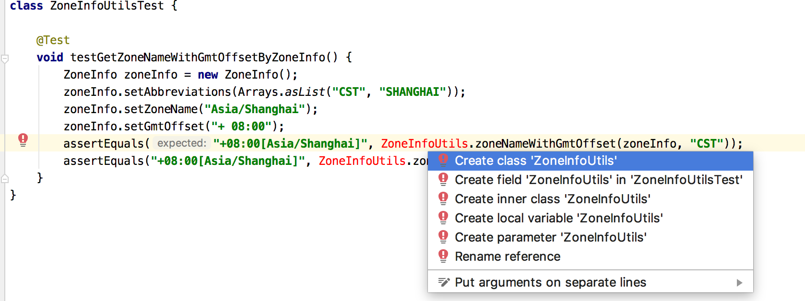
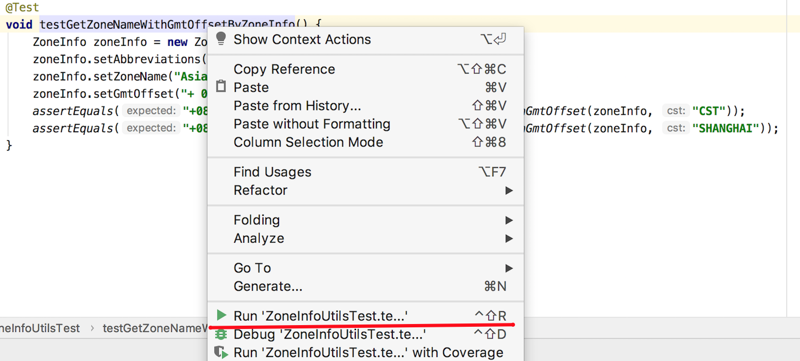
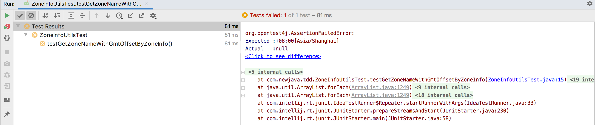
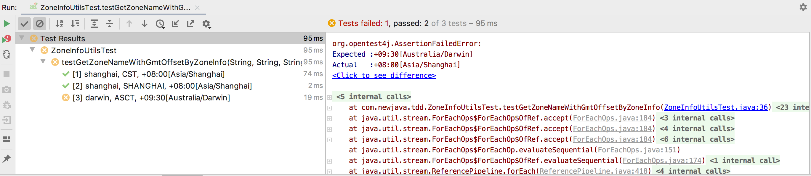
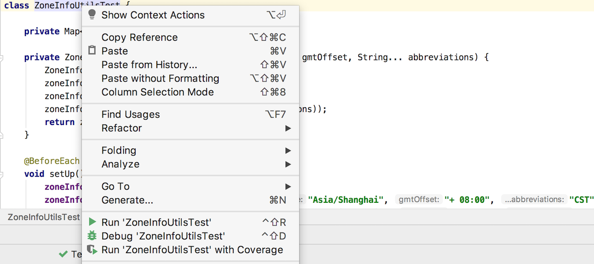
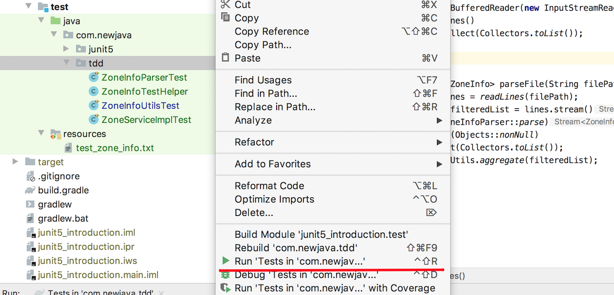

# 第4节：测试驱动开发

关于如何讲授测试驱动开发，笔者认为最好的方式是一对一的结对编程；其次是现场一对多教学或视频教学的的方式。用文字来描述测试驱动开发的过程是下策，大多数人是没有耐心去仔细研究文字描述的测试驱动开发的过程的，因为文字描述起来终究是比较啰嗦不直观。

但对于书籍来说，唯一能够选择的只有文字、代码或图形。笔者恳求读者耐心的把本章节看完，感受测试驱动开发的过程，看完本节前先不急着自己去实践。如果有读者读完本节后，能够在自己的项目中开始做一些尝试，那就不枉笔者在这节上所花费的功夫了。

笔者从一个简单的例子来熟悉测试驱动开发的过程，任务需求的想法来自Java8中对时区的处理，Java8中将时区缩略ID与时区ID的映射存储在`ZoneId`的`Map`中。关于具体的需求描述：

```wiki
输入1： 给定一个手动构造的TXT文件，文件有三列，示例如:
# Abbreviation, Zone Name, GMT Offset
CST, Asia/Shanghai, + 08:00
SHANGHAI, Asia/Shanghai, + 08:00
ACST, Australia/Darwin, + 09:30
AEDT, Australia/Sydney, + 11:00
ART, America/Argentina/Buenos_Aires, - 03:00
EET, Africa/Cairo, + 02:00

输入2： 一个用户输入的时区缩略ID字符串, 如CST

输出：返回对应的Zone Name与GMT Offset的组合, 如+08:00[Asia/Shanghai]
```

> 这里的数据与`ZoneId`里`Map`存储的数据略有不同，数据来源网站[Time Zone Database](https://timezonedb.com/)，笔者从这个网站的部分数据导出到TXT文件，

理解了需求后，笔者就开始测试驱动开发了，请紧跟笔者的思绪。

#### 拆解需求

对于上面的需求，笔者将其先拆解成成两个比较粗粒度的任务：

- T1：输入文件的处理
- T2：根据输入计算获取对应的`Zone Name`与`GMT Offset`的组合

任务T1与T2是独立的，其中任何一个任务去掉都不会影响另外一个任务。但是需要考虑把这两个独立的任务如何联系起来，笔者添加了另外两个个不那么直观但是很重要的任务：

- T3：确定任务T1和T2之间的接口方式
- T4：集成任务T1和T2

四个任务中笔者做了个优先级排序，优先级的排列基于依赖关系也基于个人的临时喜好：T3 > T2 = T1>T4。

> 个人对任务优先级的喜好也会影响代码的风格，尤其是任务之间的接口的确定。当需求变得复杂时这种影响尤其明显。

#### 任务 T3

T3是把T1和T2两个独立任务关联起来的任务，如何做这个关联呢。先需要回答两个问题？

- T1中文件解析完后放到哪里？用`Map`还是`List`?
- T2中更期望是从哪里读取数据？用`Map`还是`List`?

此时笔者的脑子里，T1和T2开始博弈:

- T1的期望的最少工作是，解析文件给出一个`List<String[]>`。
- T2的期望的最少工作是，给一个`Map<String, String>`，`key`是`Abbreviation`，`value`是`Zone Name`与`GMT Offset`的组合

最终决定是：

- T2与T1使用`List<ZoneInfo>`来建立关联
- 每个`ZoneInfo`对象代表文件中的一行数据，ZoneInfo中三个成员变量：`abbreviations`， `zoneName`， `gmtOffset`。

> 这个例子中笔者也是产品经理，所以最终决定做起来也比较容易。如`Zone Name`是唯一的，`Zone Name`与`Abbreviation`是一对多的关系。

T3的任务是创建一个`ZoneInfo`类：

```java
public class ZoneInfo {

    private List<String> abbreviations;

    private String zoneName;

    private String gmtOffset;
}
```

为了减少无用篇幅，这里没有列出`ZoneInfo`中的成员变量的`getter`和`setter`方法。

#### 任务 T2

##### 拆解

基于T3，T2的输入是`List<ZoneInfo>`和一个用户输入的`abbreviation`，返回是`Zone Name`与`GMT Offset`的组合，笔者将T2拆解为：

- T2-1：根据`abbreviation`和`List<ZoneInfo>`获取匹配的`ZoneInfo`对象。
- T2-2：根据`ZoneInfo`对象来获取`Zone Name`与`GMT Offset`的组合结果。
- T2-3：集成T2-1与T2-2。

T2-1和T2-1也是相互独立的任务，其通过`ZoneInfo`对象关联了起来。

##### 任务 T2-2

T2-2的粒度已经很小了，小到其感觉一个小方法就能容纳了，那笔者要开始着手写代码了。慢！写代码之前是不是先想想这个方法该如何验收呢？根据在上一节学习的Junit5的关于测试用例的基础知识，可以尝试用写单元测试方法的方式来写一个测试验收用例：

```java
import org.junit.jupiter.api.Test;
import java.util.Arrays;
import static org.junit.jupiter.api.Assertions.*;

class ZoneInfoUtilsTest {

    @Test
    void testGetZoneNameWithGmtOffsetByZoneInfo() {
        ZoneInfo zoneInfo = new ZoneInfo();
        zoneInfo.setAbbreviations(Arrays.asList("CST", "SHANGHAI"));
        zoneInfo.setZoneName("Asia/Shanghai");
        zoneInfo.setGmtOffset("+ 08:00");
        assertEquals("+08:00[Asia/Shanghai]", ZoneInfoUtils.zoneNameWithGmtOffset(zoneInfo, "CST"));
      	assertEquals("+08:00[Asia/Shanghai]", ZoneInfoUtils.zoneNameWithGmtOffset(zoneInfo, "SHANGHAI"));
    }
}
```

> 代码世界的命名问题是一大难题，初级程序员随意命名，而高级程序员每一天都在各种变量、方法、类命名中纠结。

上面的测试代码在IDE中会报错：无法解析zoneNameWithGmtOffset方法，因为`ZoneInfoUtils`是为了写验收测试用例而假定存在的类，`zoneNameWithGmtOffset`是假定存在的方法，现在笔者先定义这个方法解决编译错误。一般的IDE都可以很方便的解决编译错误，在错误上使用某些快捷键IDE就能帮助你去做一些事情，这里笔者使用`IntelliJ IDEA`的MacOS版，编译错误上按键`OPTION+ENTER`，就会弹出：



这里选择`Create class 'ZoneInfoUtils'`就会有弹出框`ZoneInfoUtils`需要创建的包位置。选择后，类就被自动创建了。仍然有编译错误，因为`zoneNameWithGmtOffset`方法仍然不存在，如法炮制。在IDEA的协助下创建`zoneNameWithGmtOffset`方法：

```java
public class ZoneInfoUtils {
    public static String zoneNameWithGmtOffset(ZoneInfo zoneInfo, String abbreviation) {
        return null;
    }
}
```

编译错误已经全部解决，先别急着实现代码，回到`ZoneInfoUtilsTest`类去执行测试用例看看，笔者在`ZoneInfoUtils`类中使用快捷键`CMD+SHIFT+T`即跳转到`ZoneInfoUtilsTest`类。



在测试用例上右键寻找`Run 'ZoneInfoUtilsTest.te...'`或者直接在测试用例上使用快捷键`CTRL+OPTION+R`就可以运行这个测试用例了。



测试失败了，因为目前`ZoneInfoUtilsTest`方法中返回的是`null`。笔者使用快捷键`CMD+SHIFT+T`回到`ZoneInfoUtils`类。为了让验收测试通过，可以很简单的直接让`zoneNameWithGmtOffset`直接返回`+08:00[Asia/Shanghai]`，如:

```java
public static String zoneNameWithGmtOffset(ZoneInfo zoneInfo, String abbreviation) {
  return "+08:00[Asia/Shanghai]";
}
```

这次暂时不需要跳转回`ZoneInfoUtilsTest`，而是直接使用快捷键`CTRL+R`执行刚才失败的测试用例。测试通过！这个功能就完成了，很显然不行，测试开始了与实现代码的博弈。快捷键跳转回``ZoneInfoUtilsTest``，增加一种测试场景：

```java
@Test
    void testGetZoneNameWithGmtOffsetByZoneInfo() {
        ZoneInfo zoneInfo = new ZoneInfo();
        zoneInfo.setAbbreviations(Arrays.asList("CST", "SHANGHAI"));
        zoneInfo.setZoneName("Asia/Shanghai");
        zoneInfo.setGmtOffset("+ 08:00");
        assertEquals("+08:00[Asia/Shanghai]", ZoneInfoUtils.zoneNameWithGmtOffset(zoneInfo, "CST"));
        assertEquals("+08:00[Asia/Shanghai]", ZoneInfoUtils.zoneNameWithGmtOffset(zoneInfo, "SHANGHAI"));

        zoneInfo = new ZoneInfo();
        zoneInfo.setAbbreviations(Arrays.asList("ACST"));
        zoneInfo.setZoneName("Australia/Darwin");
        zoneInfo.setGmtOffset("+ 09:30");
        assertEquals("+09:30[Australia/Darwin]", ZoneInfoUtils.zoneNameWithGmtOffset(zoneInfo, "ASCT"));
    }
```

快捷键`CTRL+R`运行测试，果然失败了。别急着跳转回`ZoneInfoUtils`去写实现代码。现在的测试代码有点`脏`，需要对测试代码做重构:

```java
class ZoneInfoUtilsTest {

    private Map<String, ZoneInfo> zoneInfoMap;

    private ZoneInfo buildZoneInfo(String zoneName, String gmtOffset, String... abbreviations) {
        ZoneInfo zoneInfo = new ZoneInfo();
        zoneInfo.setZoneName(zoneName);
        zoneInfo.setGmtOffset(gmtOffset);
        zoneInfo.setAbbreviations(Arrays.asList(abbreviations));
        return zoneInfo;
    }

    @BeforeEach
    void setUp() {
        zoneInfoMap = new HashMap<>();
        zoneInfoMap.put("shanghai", buildZoneInfo("Asia/Shanghai", "+ 08:00", "CST", "SHANGHAI"));
        zoneInfoMap.put("darwin", buildZoneInfo("Australia/Darwin", "+ 09:30", "ACST"));
    }

    @ParameterizedTest
    @CsvSource({
            "shanghai, CST,  +08:00[Asia/Shanghai]",
            "shanghai, SHANGHAI,  +08:00[Asia/Shanghai]",
            "darwin, ACST, +09:30[Australia/Darwin]",
    })
    void testGetZoneNameWithGmtOffsetByZoneInfo(String zoneInfoKey, String abbreviation,  String expected) {
        assertEquals(expected, zoneNameWithGmtOffset(zoneInfoMap.get(zoneInfoKey), abbreviation));
    }
}
```

在测试方法`testGetZoneNameWithGmtOffsetByZoneInfo`方法上使用快捷键`CTRL+OPTION+R`运行测试用例得到的结果：



可以看到，两个测试用例测试通过，一个测试用例测试失败，笔者用快捷键`CMD+SHIFT+T`跳转到`ZoneInfoUtilsTest`类去实现这个方法：

```java
public static String zoneNameWithGmtOffset(ZoneInfo zoneInfo, String abbreviation) {
  String zoneName = zoneInfo.getZoneName();
  String gmtOffset = zoneInfo.getGmtOffset().replaceAll(" ", "");
  return MessageFormat.format("{0}[{1}]", gmtOffset, zoneName);
}
```

使用快捷键`CTRL+R`执行测试，测试通过。到现在为止还没有考虑`abbreviation`这个变量，增加一个测试用例`"darwin, CST, ''"`，意味着如果`abbreviation`不在`ZoneInfo`的`abbreviations`里，则`zoneNameWithGmtOffset`方法将返回空字符串：

```java
@ParameterizedTest
@CsvSource({
  "shanghai, CST,  +08:00[Asia/Shanghai]",
  "shanghai, SHANGHAI,  +08:00[Asia/Shanghai]",
  "darwin, ACST, +09:30[Australia/Darwin]",
  "darwin, CST, ''",
})
void testGetZoneNameWithGmtOffsetByZoneInfo(String zoneInfoKey, String abbreviation,  String expected) {
  assertEquals(expected, zoneNameWithGmtOffset(zoneInfoMap.get(zoneInfoKey), abbreviation));
}
```

使用快捷键`CTRL+R`执行测试，前三个测试通过，第四个测试用例执行失败。`CMD+SHIFT+T`跳转到`ZoneInfoUtils`类去修改实现代码来修复这个错误的测试用例。

```java
public class ZoneInfoUtils {

    public static final String REG_GMT_OFFSET_REPLACE_ALL = "[^0-9:\\-\\+]";
    public static final String PATTERN_ZONE_NAME_WITH_GMT_OFFSET = "{0}[{1}]";
    public static final String EMPTY_STRING = "";

    public static String zoneNameWithGmtOffset(ZoneInfo zoneInfo, String abbreviation) {
        if (!zoneInfo.getAbbreviations().contains(abbreviation)) {
            return EMPTY_STRING;
        }
        String zoneName = zoneInfo.getZoneName();
        String gmtOffset = zoneInfo.getGmtOffset().replaceAll(REG_GMT_OFFSET_REPLACE_ALL, EMPTY_STRING);
        return MessageFormat.format(PATTERN_ZONE_NAME_WITH_GMT_OFFSET, gmtOffset, zoneName);
    }
}
```

这个方法做的修改：

- 增加了对输入参数`abbreviation`的判断

  ```java
  if (!zoneInfo.getAbbreviations().contains(abbreviation)) {
    return "";
  }
  ```

- 修改对`gmtOffset`的处理， `replaceAll`方法的第一个参数正则表达式的修改，如果对正则表达式不熟悉，这里的修改往往很容易出错。

- 将方法总的魔法常量抽取成类常量。

> 虽然方法改动不大，但笔者也不是一次修改成上面的代码，修改过程中多次使用了快捷键`CTRL+R`运行测试用例。中间过程不再赘述。

这样是不是就一切Okay，从追求完美的角度，这个方法还差的远：

- 问题1： 如果输入参数`zoneInfo`为`null`。

  对于问题1，增加一个测试用例：

  ```java
  @Test
  void testGetZoneNameWithGmtOffsetWillReturnEmptyStringWhenZoneInfoIsNull() {
    assertEquals("", zoneNameWithGmtOffset(null, null));
  }
  ```

  在这个测试方法上使用快捷键`CTRL+OPTION+R`，测试失败，使用快捷键`CMD+SHIFT+T`跳转到`ZoneInfoUtils`类进行修复。

  ```java
  public static String zoneNameWithGmtOffset(ZoneInfo zoneInfo, String abbreviation) {
    if (Objects.isNull(zoneInfo) || !zoneInfo.getAbbreviations().contains(abbreviation)) {
      return EMPTY_STRING;
    }
    String zoneName = zoneInfo.getZoneName();
    String gmtOffset = zoneInfo.getGmtOffset().replaceAll(REG_GMT_OFFSET_REPLACE_ALL, EMPTY_STRING);
    return MessageFormat.format(PATTERN_ZONE_NAME_WITH_GMT_OFFSET, gmtOffset, zoneName);
  }
  ```

  这时需要跳转回`ZoneInfoUtilsTest`并在这个类的类定义上使用快捷键`CTRL+OPTION+R`，目的是执行这个测试类的所有测试用例。

  

- 问题2： 如果zoneInfo对象中的成员变量`abbreviations`，`zoneName`以及`gmtOffst`为null。

  T2-2任务要不要处理问题2，笔者认为T2-2应该基于假设`ZoneInfo`是有效ZoneInfo的假设，先把问题留给T2-1处理。给T2-1创建一个任务T2-1-1。

  T2-3-1: 过滤掉无效的`ZoneInfo`，成员变量 `abbreviations`，`zoneName`以及`gmtOffst`任一为null都应无效。

##### 任务 T2-1

T2-2上笔者已经花费了不少时间，笔者回顾下T2-1要做什么事情：根据`abbreviation`和`List<ZoneInfo>`获取匹配的`ZoneInfo`对象。

与T2-2的节奏相同，笔者先来写验收测试用例：

```java
@ParameterizedTest
@CsvSource({
  "CST, shanghai",
  "SHANGHAI, shanghai",
  "ACST, darwin",
})
void testGetZoneInfoByZoneInfoListAndAbbreviations(String abbreviation, String expectedZoneInfoKey) {
  List<ZoneInfo> zoneInfoList = Arrays.asList(
    zoneInfoMap.get("shanghai"),
    zoneInfoMap.get("darwin")
  );
  assertEquals(zoneInfoMap.get(expectedZoneInfoKey), ZoneInfoUtils.zoneInfo(zoneInfoList, abbreviation));
}
```

有了完成T2-2的经验，一口气写了三个测试用例，而后解决编译问题，让三个测试用例通过：

```java
public static ZoneInfo zoneInfo(final List<ZoneInfo> zoneInfoList,final String abbreviation) {
  if (Objects.isNull(zoneInfoList)) {
    return null;
  }
  return zoneInfoList.stream()
    .filter(zoneInfo -> zoneInfo.getAbbreviations().contains(abbreviation))
    .findFirst()
    .orElse(null);
}
```

如果`zoneInfoList`为`null`或者找不到匹配的`ZoneInfo`， `zoneInfo`方法都将返回`null`。笔者添加测试用来验证：

```java
@Test
void testGetZoneInfoWillReturnNullWhenNoZoneInfoFound() {
  List<ZoneInfo> zoneInfoList = Collections.emptyList();
  assertNull(ZoneInfoUtils.zoneInfo(zoneInfoList, "CST"));
}

@Test
void testGetZoneInfoWillReturnNullWhenZoneInfoListIsNull() {
  assertNull(ZoneInfoUtils.zoneInfo(null, "CST"));
}
```

运行`ZoneInfoUtilsTest`中的所有测试，测试用例都测试通过。

##### 任务 T2-3

T2-3是T2的最后一个任务，其描述是： 集成T2-1与T2-2；同时T2描述：根据输入计算获取对应的`Zone Name`与`GMT Offset`的组合；T2-1创建的任务T2-3-1: 过滤掉无效的`ZoneInfo`，成员变量 `abbreviations`，`zoneName`以及`gmtOffst`任一为null都应无效。

先来写验收测试用例：

```java
@ParameterizedTest
@CsvSource({
  "CST,  +08:00[Asia/Shanghai]",
  "ACST, +09:30[Australia/Darwin]",
  "NOT_EXIST, ''",
})
void testGetZoneNameWithGmtOffsetByZoneInfoList(String abbreviation, String expected) {
  List<ZoneInfo> zoneInfoList = Arrays.asList(
    zoneInfoMap.get("shanghai"),
    zoneInfoMap.get("darwin")
  );

  assertEquals(expected, ZoneInfoUtils.zoneNameWithGmtOffset(zoneInfoList, abbreviation));
}
```

而后解决编译错误以及让测试用例通过：

```java
public static String zoneNameWithGmtOffset(final List<ZoneInfo> zoneInfoList, final String abbreviation) {
  ZoneInfo zoneInfo = zoneInfo(zoneInfoList, abbreviation);
  return zoneNameWithGmtOffset(zoneInfo);
}
```

在这个过程中我们对代码做了一些重构，譬如T2-2中的`zoneNameWithGmtOffset(ZoneInfo zoneInfo, String abbreviation)`方法的第二个参数被去掉了，因为在集成时发现`zoneInfo`方法就是根据`abbreviation`来获取`ZoneInfo`，如果获取不到就会返回null。

再继续完成任务T2-3-1: 过滤掉无效的`ZoneInfo`，成员变量 `abbreviations`，`zoneName`以及`gmtOffst`任一为null都应无效。

T2-3-1的验收测试用例：

```java
@BeforeEach
void setUp() {
  zoneInfoMap = new HashMap<>();
  zoneInfoMap.put("shanghai", buildZoneInfo("Asia/Shanghai", "+ 08:00", "CST", "SHANGHAI"));
  zoneInfoMap.put("darwin", buildZoneInfo("Australia/Darwin", "+ 09:30", "ACST"));
  zoneInfoMap.put("sydney", buildZoneInfo("Australia/Sydney", "+ 11:00", "AEDT"));
  zoneInfoMap.put("empty",  new ZoneInfo());
}
@Test
void testFilterOutAvailableZoneInfoList() {
  zoneInfoMap.get("shanghai").setAbbreviations(null);
  zoneInfoMap.get("darwin").setGmtOffset(null);
  zoneInfoMap.get("sydney").setZoneName(null);
  List<ZoneInfo> zoneInfoList = Arrays.asList(
    zoneInfoMap.get("shanghai"),
    zoneInfoMap.get("darwin"),
    zoneInfoMap.get("sydney"),
    zoneInfoMap.get("empty")
  );

  assertEquals(0, ZoneInfoUtils.availableZoneInfoList(zoneInfoList).size());
}
```

在这里对实现代码和测试代码都进行了重构，重构后的实现代码：

```java
public class ZoneInfoUtils {

    public static final String REG_GMT_OFFSET_REPLACE_ALL = "[^0-9:\\-\\+]";
    public static final String PATTERN_ZONE_NAME_WITH_GMT_OFFSET = "{0}[{1}]";
    public static final String EMPTY_STRING = "";

    static String zoneNameWithGmtOffset(final ZoneInfo zoneInfo) {
        if (Objects.isNull(zoneInfo)) {
            return EMPTY_STRING;
        }
        String zoneName = zoneInfo.getZoneName();
        String gmtOffset = zoneInfo.getGmtOffset().replaceAll(REG_GMT_OFFSET_REPLACE_ALL, EMPTY_STRING);
        return MessageFormat.format(PATTERN_ZONE_NAME_WITH_GMT_OFFSET, gmtOffset, zoneName);
    }

    static ZoneInfo zoneInfo(final List<ZoneInfo> zoneInfoList,final String abbreviation) {
        Objects.requireNonNull(zoneInfoList);
      
        return zoneInfoList.stream()
                .filter(zoneInfo -> zoneInfo.getAbbreviations().contains(abbreviation))
                .findFirst()
                .orElse(null);
    }

    static List<ZoneInfo> availableZoneInfoList(List<ZoneInfo> zoneInfoList) {
        Objects.requireNonNull(zoneInfoList);

        return zoneInfoList.stream()
                .filter(zoneInfo -> Objects.nonNull(zoneInfo.getAbbreviations()))
                .filter(zoneInfo -> Objects.nonNull(zoneInfo.getGmtOffset()))
                .filter(zoneInfo -> Objects.nonNull(zoneInfo.getZoneName()))
                .collect(Collectors.toList());
    }

    public static String zoneNameWithGmtOffset(final List<ZoneInfo> zoneInfoList, final String abbreviation) {
        if (Objects.isNull(zoneInfoList)) {
            return EMPTY_STRING;
        }
        List<ZoneInfo> availableZoneInfoList = availableZoneInfoList(zoneInfoList);
        ZoneInfo zoneInfo = zoneInfo(availableZoneInfoList, abbreviation);
        return zoneNameWithGmtOffset(zoneInfo);
    }
}
```

主要重构的地方有：

- 除了`zoneNameWithGmtOffset(final List<ZoneInfo> zoneInfoList, final String abbreviation)`方法，其他的方法都移除了`public`修饰符，使得其只能包内可见。意味着只有一个对外的接口。
- `zoneInfo`和`availableZoneInfoList`方法都使用了`Objects.requireNonNull(zoneInfoList)`，表示作为包内方法，如果后续有其他开发人员调用此方法时一定要注意传入参数是非`null`的。

最终的测试代码：

```java
class ZoneInfoUtilsTest {

    private Map<String, ZoneInfo> zoneInfoMap;

    private ZoneInfo buildZoneInfo(String zoneName, String gmtOffset, String... abbreviations) {
        ZoneInfo zoneInfo = new ZoneInfo();
        zoneInfo.setZoneName(zoneName);
        zoneInfo.setGmtOffset(gmtOffset);
        zoneInfo.setAbbreviations(Arrays.asList(abbreviations));
        return zoneInfo;
    }

    @BeforeEach
    void setUp() {
        zoneInfoMap = new HashMap<>();
        zoneInfoMap.put("shanghai", buildZoneInfo("Asia/Shanghai", "+ 08:00", "CST", "SHANGHAI"));
        zoneInfoMap.put("darwin", buildZoneInfo("Australia/Darwin", "+ 09:30", "ACST"));
        zoneInfoMap.put("sydney", buildZoneInfo("Australia/Sydney", "+ 11:00", "AEDT"));
        zoneInfoMap.put("empty",  new ZoneInfo());
    }

    @ParameterizedTest
    @CsvSource({
            "shanghai, +08:00[Asia/Shanghai]",
            "shanghai, +08:00[Asia/Shanghai]",
            "darwin, +09:30[Australia/Darwin]",
            "NOT_EXIST, ''",
    })
    void testGetZoneNameWithGmtOffsetByZoneInfo(String zoneInfoKey, String expected) {
        assertEquals(expected, ZoneInfoUtils.zoneNameWithGmtOffset(zoneInfoMap.get(zoneInfoKey)));
    }

    @ParameterizedTest
    @CsvSource({
            "CST, shanghai",
            "SHANGHAI, shanghai",
            "ACST, darwin",
    })
    void testGetZoneInfoByZoneInfoListAndAbbreviation(String abbreviation, String expectedZoneInfoKey) {
        List<ZoneInfo> zoneInfoList = Arrays.asList(
                zoneInfoMap.get("shanghai"),
                zoneInfoMap.get("darwin")
        );
        assertEquals(zoneInfoMap.get(expectedZoneInfoKey), ZoneInfoUtils.zoneInfo(zoneInfoList, abbreviation));
    }

    @Test
    void testGetZoneInfoWillReturnNullWhenNoZoneInfoFound() {
        List<ZoneInfo> zoneInfoList = Collections.emptyList();
        assertNull(ZoneInfoUtils.zoneInfo(zoneInfoList, "CST"));
    }

    @ParameterizedTest
    @CsvSource({
            "CST,  +08:00[Asia/Shanghai]",
            "ACST, +09:30[Australia/Darwin]",
            "NOT_EXIST, ''",
    })
    void testGetZoneNameWithGmtOffsetByZoneInfoList(String abbreviation, String expected) {
        List<ZoneInfo> zoneInfoList = Arrays.asList(
                zoneInfoMap.get("shanghai"),
                zoneInfoMap.get("darwin"),
                zoneInfoMap.get("empty")
        );

        assertEquals(expected, ZoneInfoUtils.zoneNameWithGmtOffset(zoneInfoList, abbreviation));
    }

    @Test
    void testGetZoneNameWithGmtOffsetWillReturnEmptyStringWhenZoneInfoListIsNull() {
        assertEquals("", ZoneInfoUtils.zoneNameWithGmtOffset(null, null));
    }

    @Test
    void testFilterOutAvailableZoneInfoList() {
        zoneInfoMap.get("shanghai").setAbbreviations(null);
        zoneInfoMap.get("darwin").setGmtOffset(null);
        zoneInfoMap.get("sydney").setZoneName(null);
        List<ZoneInfo> zoneInfoList = Arrays.asList(
                zoneInfoMap.get("shanghai"),
                zoneInfoMap.get("darwin"),
                zoneInfoMap.get("sydney"),
                zoneInfoMap.get("empty")
        );

        assertEquals(0, ZoneInfoUtils.availableZoneInfoList(zoneInfoList).size());
    }
}
```

T2任务的到这基本就结束了，代码虽然变得越来越庞大，但是对产出代码的质量确一直保持着比较足的信心。是时候停下来休息一会去喝杯咖啡了！

> 在描述过程中笔者一直强调IDEA的快捷键，是笔者忍不住通过这种重复啰嗦来强调快捷键的使用，其能大大提高工作效率，也能提升程序员编码时的幸福感。谁说写代码时指尖精准飞舞就不是一门艺术呢？

#### 任务 T1

T1：输入文件的处理，将文本文件的内容转换成一个`List<ZoneInfo>`。

##### 拆解

任务T1比任务T2拆解难度更小一些：

- T1-1：读取文件的所有行，解析成`List<ZoneInfo>`
- T1-2：针对一个字符串（如文件中的一行），生成ZoneInfo对象
- T1-3：集成T1-1与T1-2，对`List<ZoneInfo>`里的所有`Zone Name`相同的元素进行聚合

> 基于对于任务T2的测试驱动开发过程的详细描述，有了对T1的任务拆解，你是否可以尝试独立进行测试驱动开发的尝试呢？

##### 任务 T1-2

第一个验收测试用例：

```java
@ParameterizedTest
@CsvSource({
        "'CST, Asia/Shanghai, + 08:00', CST, Asia/Shanghai, + 08:00",
  			"' CST  ,  Asia/Shanghai  ,  + 08:00  ', CST, Asia/Shanghai, + 08:00",
})
void testParseStringThenGenerateZoneInfo(String line,
                                         String expectedAbbreviation,
                                         String expectedZoneName,
                                         String expectedGmtOffset) {
    ZoneInfo zoneInfo = ZoneInfoParser.parse(line);
    assertEquals(expectedZoneName, zoneInfo.getZoneName());
    assertEquals(expectedGmtOffset, zoneInfo.getGmtOffset());
    assertEquals(1, zoneInfo.getAbbreviations().size());
    assertEquals(expectedAbbreviation, zoneInfo.getAbbreviations().get(0));
}
```

用例中考虑了字符串中空格被意外引入的情况，代码实现:

```java
import java.util.ArrayList;
import java.util.List;

public class ZoneInfoParser {
    public static ZoneInfo parse(String line) {
        String[] splits = line.split("\\s*,\\s*");
        List<String> abbreviations = new ArrayList<>();
        ZoneInfo zoneInfo = new ZoneInfo();
        abbreviations.add(splits[0]);
        zoneInfo.setAbbreviations(abbreviations);
        zoneInfo.setZoneName(splits[1]);
        zoneInfo.setGmtOffset(splits[2]);
        return zoneInfo;
    }
}
```

但上面的测试用例只针对了正常输入，对于异常输入也需要处理，不满足条件的输入都会返回`null`，见测试用例：

```java
@ParameterizedTest
@NullAndEmptySource
@ValueSource(strings = {
        // The elements number(separate by ,) in a line is not equal to 3
        "A",
        "A, B",
        "A, B, C, D",
  
  			// A line with comment #
        "# CST, Asia/Shanghai, + 08:00",
        "   # CST, Asia/Shanghai, + 08:00",
})
void testParseWithUnexpectedInputWillReturnNull(String line) {
    assertNull(ZoneInfoParser.parse(line));
}
```

T1-2的最终实现代码：

```java
public class ZoneInfoParser {

    public static final String REG_VALUE_SEPARATOR = "\\s*,\\s*";
    public static final String COMMENT_LINE_PREFIX = "#";

    public static ZoneInfo parse(String line) {
        if (Objects.isNull(line) || line.trim().startsWith(COMMENT_LINE_PREFIX)) {
            return null;
        }

        String[] splits = line.split(REG_VALUE_SEPARATOR);
        if (3 == splits.length) {
            List<String> abbreviations = new ArrayList<>();
            ZoneInfo zoneInfo = new ZoneInfo();
            abbreviations.add(splits[0].trim());
            zoneInfo.setAbbreviations(abbreviations);
            zoneInfo.setZoneName(splits[1].trim());
            zoneInfo.setGmtOffset(splits[2].trim());
            return zoneInfo;
        }
        return null;
    }
}
```

##### 任务 T1-1

文件的读取需要考虑异常场景，也需要考虑Java的两种对文件处理的方式：

- 一种是根据文件的绝对路径来读取文件
- 一种是根据文件的classpath路径来读取文件

先编写针对绝对路径读取文件的代码：

```java
@Nested
class ParseFileTest {

  @TempDir
  Path sharedTempDir;

  String fileAbsolutePath;

  @BeforeEach
  static void setUp() throws FileNotFoundException {
      Path file = sharedTempDir.resolve("test.txt");
      try (PrintWriter pw = new PrintWriter(file.toFile())){
          fileAbsolutePath = file.toAbsolutePath().toString();
          pw.println("# Abbreviation, Zone Name, GMT Offset");
          pw.println("SHANGHAI, Asia/Shanghai, + 08:00");
          pw.println("ACST, Australia/Darwin, + 09:30");
      }
  }

  @Test
  void testReadFileWithAbsolutePathAndReturnStringList() throws IOException {
      List<String> lines = ZoneInfoParser.readLines(fileAbsolutePath);
      assertEquals(3, lines.size());
  }
}
```

> 这里在测试类`ZoneInfoParserTest`中使用了内部测试类`ParseFileTest`和注解`@Nested`，这样，在`ParseFileTest`中的文件初始化就不会影响不需要文件操作的其他测试方法。

实现代码很简单：

```java
public static List<String> readLines(String filePath) throws IOException {
	return Files.readAllLines(Paths.get(filePath));
}
```

但是对于classpath的文件的读取，先在test/resources目录创建`test_zone_info.txt`，然后编写验收测试用例：

```java
@Test
void testReadFileWithClassPathAndReturnStringList() throws IOException {
  List<String> lines = ZoneInfoParser.readLines("test_zone_info.txt");
  assertEquals(3, lines.size());
}

@Test
void testReadFileWithNotExistFileWillThrowIOException() {
  final String absolutePath = "/ANY_PATH/NOT_EXISTED_FILE.txt";
  assertThrows(IOException.class, () -> ZoneInfoParser.readLines(absolutePath));
  assertThrows(IOException.class, () -> ZoneInfoParser.readLines("NOT_EXISTED_FILE.txt"));
}
```

获取到`List<String>`后，需要将其转化为`List<ZoneInfo>`对象，验收测试：

```java
void testParseFileAndReturnZoneInfoList() throws IOException {
  List<ZoneInfo> zoneInfoList = ZoneInfoParser.parseFile("test_zone_info.txt");
  assertEquals(3, zoneInfoList.size());
}
```

> 每一个有效的输入行都会生成一个`ZoneInfo`对象

T1-1最终实现代码为：

```java
public static List<String> readLines(String filePath) throws IOException {
    Path path = Paths.get(filePath);
    if (path.isAbsolute()) {
        return Files.readAllLines(path);
    }
    ClassLoader classLoader = ZoneInfoParser.class.getClassLoader();
    try (InputStream inputStream = classLoader.getResourceAsStream(filePath)) {
        if (Objects.isNull(inputStream)) {
            throw new IOException();
        }
        return new BufferedReader(new InputStreamReader(inputStream))
                .lines()
                .collect(Collectors.toList());
    }
}

public static List<ZoneInfo> parseFile(String filePath) throws IOException {
    List<String> lines = readLines(filePath);
    List<ZoneInfo> filteredList = lines.stream()
            .map(ZoneInfoParser::parse)
            .filter(Objects::nonNull)
            .collect(Collectors.toList());
    return filteredList;
}
```

##### 任务 T1-3

T1-3需要集成T1-1和T1-2，集成的主要目的是将`Zone Name`相同的`ZoneInfo`对象合并成一个`ZoneInfo`对象。先给出两个验收测试用例，测试用例放在`ZoneInfoUtilsTest`中：

```java
@Test
void testAggregateWillCombineZoneInfoWithSameZoneName() {
    List<ZoneInfo> zoneInfoList = Arrays.asList(
            zoneInfoMap.get("darwin"),
            zoneInfoMap.get("darwin2")
    );

    List<ZoneInfo> aggregatedList = ZoneInfoUtils.aggregate(zoneInfoList);
    assertEquals(1, aggregatedList.size());
    ZoneInfo zoneInfo = aggregatedList.get(0);
    assertEquals("Australia/Darwin", zoneInfo.getZoneName());
    assertIterableEquals(Arrays.asList("ACST", "DARWIN"), zoneInfo.getAbbreviations());
}

@Test
void testAggregateWillNotCombineZoneInfoWithDifferentZoneName() {
    List<ZoneInfo> zoneInfoList = Arrays.asList(
            zoneInfoMap.get("shanghai"),
            zoneInfoMap.get("darwin")
    );
    List<ZoneInfo> aggregatedList = ZoneInfoUtils.aggregate(zoneInfoList);
    System.out.println(aggregatedList);
    assertEquals(2, aggregatedList.size());
}
```

> 在写测试用例的过程中我们对测试代码做了一些细微的重构，这里不做详述。

实现代码略有些复杂:

```java
static ZoneInfo combine(ZoneInfo master, ZoneInfo slave) {
    ZoneInfo zoneInfo = new ZoneInfo();
    zoneInfo.setZoneName(master.getZoneName());
    zoneInfo.setGmtOffset(master.getGmtOffset());
    List<String> abbreviations = Stream.concat(
            master.getAbbreviations().stream(),
            slave.getAbbreviations().stream()
    ).collect(Collectors.toList());
    zoneInfo.setAbbreviations(abbreviations);
    return zoneInfo;
}

public static List<ZoneInfo> aggregate(List<ZoneInfo> zoneInfoList) {
    return zoneInfoList.stream()
            .collect(
                    Collectors.groupingBy(
                            ZoneInfo::getZoneName,
                            Collectors.reducing(ZoneInfoParser::combine)
                    )
            )
            .values()
            .stream()
            .map(Optional::get)
            .collect(Collectors.toList());
}
```

> 实现代码使用了`Stream`里比较高级的`collect`和`groupBy`的用法。代码的语义理解并不难！

笔者经过一番思想斗争，决定对`ZoneInfoParser`的`parseFile`略做修改，对此方法的返回值做`aggregate`处理。

```java
public static List<ZoneInfo> parseFile(String filePath) throws IOException {
    List<String> lines = readLines(filePath);
    List<ZoneInfo> filteredList = lines.stream()
            .map(ZoneInfoParser::parse)
            .filter(Objects::nonNull)
            .collect(Collectors.toList());
    return ZoneInfoUtils.aggregate(filteredList);
}
```

在确定T3任务完成前，笔者需要保证所有测试用例是通过的。



在Intellij IDEA树形结构的的相应测试目录上使用快捷键`CTRL+OPTION+R`执行包下的所有测试。

#### 任务 T4

T1, T2, T3的任务我们均已完成，T4来做最后的集成，这个集成的具体需求其实并不明确，笔者这里计划提供一个单例的`service`和一个`App`的`main`方法以供测试。

关于`service`，`service`类的三个基本功能：

- 在构造时会解析和初始化文件
- 提供可公共访问的接口来根据输入获取输出
- 输入参数处理

```java
public class ZoneServiceImplTest {

    private ZoneService zoneService;

    @BeforeEach
    void setUp() throws IOException {
        zoneService = new ZoneServiceImpl("zone_info.txt");
    }

    @ParameterizedTest
    @CsvSource({
            "CST, +08:00[Asia/Shanghai]",
            "' CST ', +08:00[Asia/Shanghai]",
            "cst, +08:00[Asia/Shanghai]",
    })
    void testGetZoneNameWithGmtOffsetByAbbreviation(String zoneAbbreviation, String expected) {
        String zoneNameWithGmtOffice = zoneService.zoneNameWithGmtOffice(zoneAbbreviation);
        assertEquals(expected, zoneNameWithGmtOffice);
    }
}
```

> 测试用例中考虑了输入参数前后有空格，输入参数为小写的情况

实现代码：

```java
public class ZoneServiceImpl implements ZoneService {

    private final List<ZoneInfo> zoneInfoList;

    public ZoneServiceImpl(String filePath) throws IOException {
        super();
        zoneInfoList = ZoneInfoParser.parseFile(filePath);
    }

    @Override
    public String zoneNameWithGmtOffice(String zoneAbbreviation) {
        if (Objects.isNull(zoneAbbreviation)) {
            return "";
        }
        String processedAbbreviation = zoneAbbreviation.trim().toUpperCase();
        return ZoneInfoUtils.zoneNameWithGmtOffset(zoneInfoList, processedAbbreviation);
    }
}
```

最后就是`App`类`main`方法的临时实现了：

```java
public class App {

    private ZoneService zoneService;

    public App(String filePath) throws IOException  {
        zoneService = new ZoneServiceImpl(filePath);
    }

    public static void main(String[] args) {
        String filePath = "zone_info.txt";
        if (args.length > 0) {
            filePath = args[0];
        }

        App app =null;
        try {
            app = new App(filePath);
        } catch (IOException e) {
            System.out.println("Can't find the file " + filePath);
            System.exit(1);
        }

        while (true) {
            Scanner scanner = new Scanner(System.in);
            String prompt = "Please input a zone abbreviation, type exit to quit the program!";
            System.out.println(prompt);
            while(scanner.hasNext()) {
                String zoneAbbreviation = scanner.next();
                if ("exit".equalsIgnoreCase(zoneAbbreviation.trim())) {
                    System.exit(0);
                }
                
                String response = app.zoneService.zoneNameWithGmtOffice(zoneAbbreviation);
                if (Objects.isNull(response) || "".equals(response)) {
                    System.out.println("NOT FOUND");
                } else {
                    System.out.println(response);
                }
            }
        }
    }
}

```

在`App`的`main`方法上使用快捷键`CTRL+OPTION+R`执行`main`函数：

```java
> Task :App.main()
Please input a zone abbreviation, type exit to quit the program!
CST
+08:00[Asia/Shanghai]
shanghai
+08:00[Asia/Shanghai]

AEDT
+11:00[Australia/Sydney]
ABCDE
NOT FOUND
exit
```

笔者对这个功能的测试驱动开发过程到这就结束了，在这里留下一个扩展问题？

输入文件中的时区缩略词如果考虑大小写的情况，基于上面已经开发完成的代码，你会从哪里开始你的修改呢？

> 笔者当然希望你是从增加验收测试用例开始：增加测试用例 -> 运行测试让增加的验收测试运行失败 -> 修改实现代码让验收测试运行通过 -> 运行所有测试确保没有测试运行失败。

#### 小结

本节尝试让读者比较全面的体验一次测试驱动开发的过程，总结一些知识点/经验如下：

- 将需求逐步拆解为粒度小的任务，这些任务的功能小到一个对象方法就能完成。

- 先有验收测试，再有实现代码，实现代码最直接的目的是为了让验收测试用例测试通过。

- 对于测试驱动开发的初学者，建议参考T2任务完成过程的小步走模式，测试用例和实现代码一小步一小步的变得完善 。

- 对于已经熟练于测试驱动开发的程序员，希望你能将测试驱动开发的好用之处宣传给你的同事朋友程序员。

- 测试代码的重构与实现代码的重构同等重要，整洁可用的代码即是实现代码的目标，也是测试代码的目标。

- 微妙的是，测试代码与实现代码的目的是有所不同的，测试代码希望直观的表达验收测试：一个测试方法一类验收测试用例；尽量直观的期望结果。关于写好单元测试的一些技巧，下一节会做详细描述。

- 使用一个好的IDE去帮助开发，尽可能多的使用快捷键，让键盘的节奏跟上你的思维。第三章会比较详细介绍对`Intellij IDEA`的使用经验。

  

