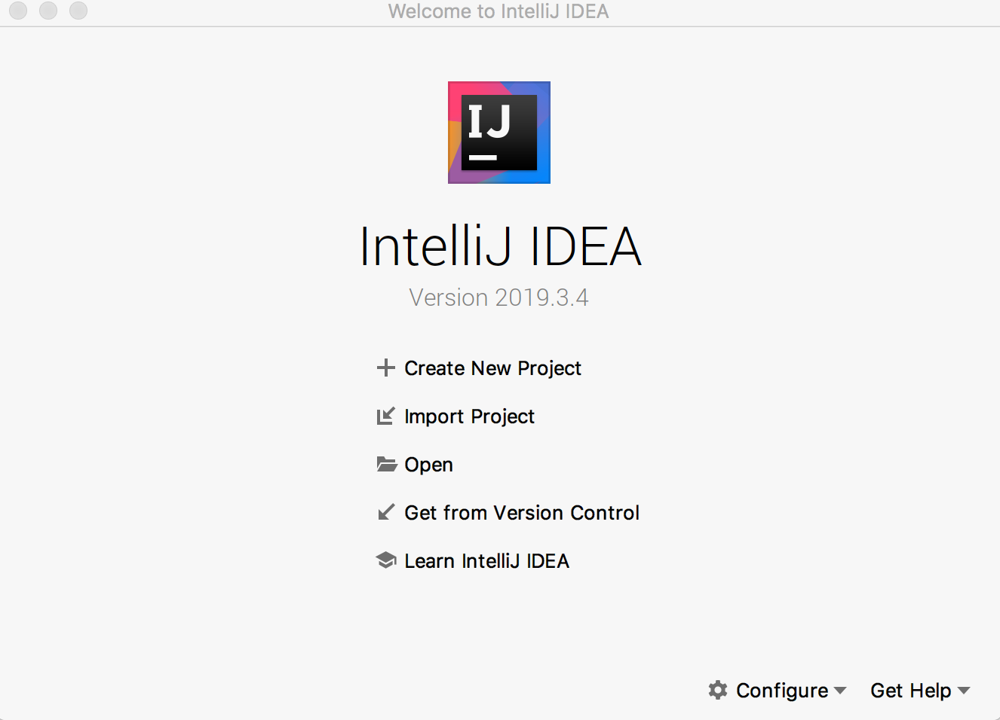

# 第1节：IntelliJ IDEA准备

#### 安装

Intellij IDEA安装包自己带有JRE（Java运行环境），但还是建议本机先安装JDK（Java开发环境）再安装Intellij IDEA。

##### 安装JDK

有三种主流的JDK可以下载，这里以JDK11为例子：

Oracle JDK: [https://www.oracle.com/java/technologies/javase-jdk11-downloads.html](https://www.oracle.com/java/technologies/javase-jdk11-downloads.html)

Amazon OpenJDK: [https://amazonaws-china.com/corretto/](https://amazonaws-china.com/corretto/) 

Community OpenJDK: [http://jdk.java.net/java-se-ri/11](http://jdk.java.net/java-se-ri/11)

如果是个人学习，可以随意使用上面列出的任一一种，对于个人学习都是免费的。对于企业使用，如果还是希望享用免费午餐的，建议使用Amazon OpenJDK或者社区维护的OpenJDK。

> 下载Oracle JDK前需要注册一个Oracled的账号，下载界面点击下载图标时会跳转到账号登录/注册的页面。

安装一般来说有两种方式：小白安装方式和程序员安装方式，先来介绍小白安装方式。


上图为Oracle JDK的下载页面，包后缀名为`.deb`，`.rpm`，`.dmg`和`.exe`的都是提供的小白式的安装包。譬如：

- `.exe`文件在`Windows`操作系统中下载后双击打开，就会打开安装向导界面，就像在`Windows`操作系统上安装其他软件一样，根据向导提示安装即可。
- `.dmg`文件在`MacOS`操作系统双击打开，同样会有安装向导界面指导安装。
- `.rpm`文件在有`rpm`命令的`Linux`操作系统（如`Redhat`)中，使用命令如`rpm -ivh jdk-11.0.6_linux-x64_bin.rpm`来安装。
- `.deb`文件在`Debian`操作系统中，使用命令如`apt install jdk-11.0.6_linux-x64_bin.deb`来安装。

小白安装方式安装了`Java`后，在命令行（MacOS和Linux相关操作系统中的`Terminal`，Window操作系统的`cmd`窗口)中执行`java -version`就能看到`Java`的版本信息。在`macOS`系统中：

```shell
⇒  java -version
java version "11.0.6" 2020-01-14 LTS
Java(TM) SE Runtime Environment 18.9 (build 11.0.6+8-LTS)
Java HotSpot(TM) 64-Bit Server VM 18.9 (build 11.0.6+8-LTS, mixed mode)
```

程序员安装方式是直接下载`zip`包或者`tar`包安装，下载上图中对应系统的`zip`包或者`tar.gz`包。

`Linux`相关操作系统中，解压Java的安装包(`.tar.gz`)：

```shell
tar zxvf jdk-11.0.6_linux-x64_bin.tar.gz
```

或`Windows`操作系统中，使用`Winzip`或者`7Z`等软件解压Java的安装包(`.zip`)。

而后设置Java相关环境变量，在`Linux`操作系统中，将如下命令放入相关`SHELL`的`Profile`文件(如`bash`的`~/.bash_profile`）中：

```shell
export JAVA_HOME=/path/to/jdk-11.0.6.jdk
export PATH=$JAVA_HOME/bin:$PATH
```

`Windows`操作系统中，通过界面的方式设置：

- 在“我的电脑”上右击鼠标，在弹出菜单中选择“属性”。

- 在“系统”界面选择“高级系统设置”，打开“环境变量设置”来设置环境变量`JAVA_HOME`和`PATH`。

  > 新建一个环境变量JAVA_HOME，值为解压后的JDK路径；在PATH环境变量上新添加一项`%JAVA_HOME%/bin`。

> 程序员安装方式是典型的绿色版安装，如果希望在操作系统中安装多个JDK版本，使用这种方式可以很方便的在不同版本的JDK之间做切换。

##### 安装Intellij IDEA

Intellij IDEA有旗舰(`Ultimate`)版和社区(`Community`)版，旗舰版30天试用期后需要购买`License`才能继续使用。社区版是永久免费且开源，两者的功能对比：


Commercial列即表示旗舰版支持的功能，Open-source列即表示社区版支持的功能。这里需要特别注意的是关于对Spring和Java EE的支持，并不意味着社区版就不能进行Spring和Java EE的开发，只是少了一些内嵌工具集，笔者认为少了这些工具集对开发的影响甚微，尤其是如果开发者使用Spring Boot框架做Java EE相关开发工作的话。

下载社区版还是旗舰版读者自行选择。安装包下载的地址：[https://www.jetbrains.com/idea/download](https://www.jetbrains.com/idea/download)，进入下载地址后选择自己使用的操作系统对应的安装包下载，下载后根据安装包的安装向导提示完成安装即可。

#### 手动创建项目

打开安装的IntelliJ IDEA:



选择`Create New Project`:


默认左边菜单中选择`Java`，在点击右下角`Next`之前，可以点击右上角的`New`按钮来引入新的JDK，笔者这里将使用JDK11，所以选择了JDK11安装的目录:


选择好JDK11目录，再选择`Next`：


勾选`Create project from template`，然后点击右下角的`Next`按钮：


填写好`Project name`和`Base package`，选择项目文件存放的位置`Project Location`，而后点击`Finish`:


将`// write your code here`替换成`System.out.println("Hello Intellij IDEA!");`:


将光标放在`main`方法身上，右键：


点击右键弹出选项里的`Run 'Main'`:


可以看到Java程序打印出来的`Hello Intellij IDEA!`。也可以IDEA用的是`jdk-11.0.6`来执行这段代码。下一节将基于这一节创建的项目，来开启对IDEA的魅力探索之旅。