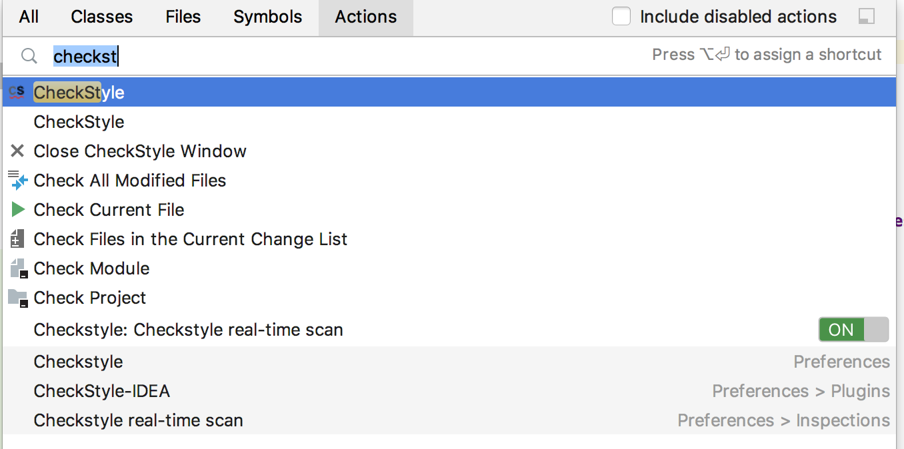

# 第3节：常用插件

IDEA本身功能就很强大， 而其插件在原有强大能力之外无限扩展，甚至可以自己开发插件满足特定的需求。

关于插件的安装，`⌘,`|`Ctrl+Alt+S`打开IDEA的配置界面，搜索`Plugins`:


在中间的搜索栏搜索插件安装即可。

#### Key Promoter X

`Key Promoter X`是一款辅助快捷键使用的插件，当你用鼠标在IDEA内摸索点击后，其会在右下角提示你可以使用的快捷键。这个插件还会记录你这些快捷键应该被使用但没有被使用的次数。


对于没有快捷键的一些菜单或按钮，`Key Promoter X`也会提示去设置一个快捷键：


点击`Regex Tester`就会跳转到快捷键设置页面，可以为其自定义一个快捷键。

`Key Promoter X`比`Key Promoter`更稳定，因为其使用了IDEA自己提供的气泡提示功能。

#### IDEA Features Trainer

`IDEA Features Trainer`是IDEA安装时自带的IDEA学习的插件：


在打开IDEA时有个`Learn IntelliJ IDEA`的链接，点击链接后将进入学习页面就可以愉快的进行一些IDEA基础快捷键的学习：


#### Grazie

智能拼写和语法检查，程序员经常犯的小错是把单词拼错，有了这款插件，就可以方便的发现代码中的拼写问题，也可以方便的进行纠正：


`⌥↩`|`Alt+Enter`就可以获得提示，`Typo: Rename to...`列出在第一个提示且自动选择上，`↩`|`Enter`：


提示列表中选择需要修改为的内容即可。

#### RegexpTester

正则表达式测试插件，在做字符串相关正则表达式处理时很有用。安装完此插件后，其在IDEA下部工具栏出现`Regex Tester`的图标，鼠标点击即可打开。或`⌃⇧A`|`Ctrl+Shift+A`打开IDEA的命令搜索窗口，输入`Regex Tester`后`↩`|`Enter`即可打开其窗口：


#### CheckStyle-IDEA

`CheckStyle`插件用来检查Java代码的规范性，默认安装插件后会自带Google的规范和Sun的规范，也可以自定义`CheckStyle`规范后导入：


而后`⌃⇧A`|`Ctrl+Shift+A`打开IDEA的命令搜索窗口，输入`CheckStyle`，可以看到CheckStyle可用的命令列表，可以检查整个项目，也可以只单独检查某个文件：



#### GenerateAllSetter

对于Java中的实体类，一般都使用`setter`去获取值，而使用`getter`方法去获取值。一个一个的手写`getter`方法调用或`setter`方法调用是比较枯燥的，这个插件就解决了这个问题。


在`User user = new User()`这一行，`⌥↩`|`Alt+Enter`就可以获得上述截图的提示。`Assert all getters`将自动生成所有`getter`方法的断言语句，不过其断言是使用Junit4原生支持但Junit5并不原生支持的`assertThat`:

`Generate all setter with default value`将自动生成所有的`setter`方法并给出默认值，如:

```java
user.setName("");
user.setAge(0);
```

#### GsonFormat

安装了`GsonFormat`插件后，在定义的空类`User`上，`⌥S`|`AltS`就可以打开`GsonFormat`的窗口：


输入JSON串后，点击`OK`:


默认将Json中的Key都生成成员变量和`getter`和`setter`方法。

#### Java Bean to Json

`GsonFormat`将Json字符串转换为Java实体类，而`Java Bean to Json`插件是在实体类中生成`json`字符串。

在`GsonFormat`插件生成的`User`类上`⌃⇧A`|`Ctrl+Shift+A`打开IDEA的命令搜索窗口，输入`ConvertToJson`，将生成Json字符串到剪切板中：

```json
{
  "name": "",
  "age": 0
}
```

#### 其他

- BashSupport插件使得在IDEA上写shell脚本更加方便
- Gradle插件提供了对Gradle的支持
- Maven Helper插件提供了对maven的支持
- Free MyBatis plugin提供了对MyBatis库的支持，连接`MySQL`后可以自动生成`mapper.xml`文件等
- Emmet插件可以让IDEA支持`HTML Emmet`
- Lombok插件对项目中引入的`lombok`依赖进行支持，用注解的方式隐藏了实体类的`getter`和`setter`方法或提供实体类的`Builder`类，建议学习下`lombok`的使用后再使用这款插件。


