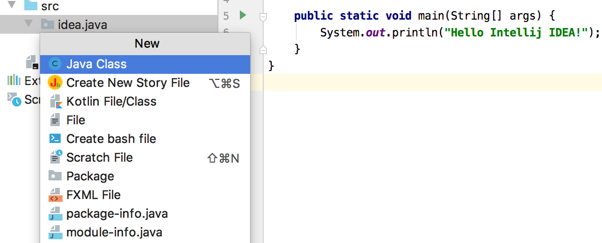

# 第2节：苦练快捷键

这一节主要学习如何使用Intellij IDEA（简称IDEA）的快捷键，建议读者跟随每一个步骤进行操练：

- 实现`IntegerUtils`类的`isPalindrome`方法来判断某个整数是否为素数，通过此示例入门IDEA快捷键使用。
- 重构`main`方法已实现的代码，此代码从参数中解析出端口和IP地址，通过此示例入门IDEA中使用快捷键重构代码。

本节使用的是上一节创建的`idea-java`项目，在练习本节内容前，尽量使用快捷键，不得已时才使用鼠标。

本节的快捷键是Intellij IDEA提供的默认`Keymap`，文中将给出`macOS`和`Windows`默认两套快捷键，默认给出两个操作系统的快捷键如`⌘\`|`Ctrl+/`，`|`前部分是MacOS操作系统中的快捷键，后部分为Windows操作系统中的快捷键，Windows快捷键中的`+`仅仅是分隔按键符号的符号。

关于MacOS操作系统的快捷键的一些简写：

- ⌃，表示`control`键
- ⇧，表示`shift`键
- ⌘，表示`command`键
- ⌥，表示`option`键
- ↩，表示`Enter`回车键
- ↑↓←→，表示键盘中的Up键
- ⇥，表示`Tab`键
- ⌫，表示删除键

回顾上一节创建的项目：


#### 实现isPrime方法

首先要介绍的快捷键大家都很熟悉，`⌘S|Ctrl+S`保存修改到文件，虽然IDEA有自动保存的功能，笔者还是建议常常使用`⌘S|Ctrl+S`。下面的快捷键不会提到`⌘S|Ctrl+S`，但读者在练习时要记得经常保存自己的修改。

##### 创建新文件IntegerUtils

`⌘1`|`Alt+1`打开项目结构，且光标会移动到属性结构中：


`↑`|`Up`选中idea.java项，`⌘N`|`Alt+Insert`将弹出创建菜单:



> 注意：有一些安装Windows操作系统的笔记本键盘没有`Insert`键，可以在IDEA上设置其他键。`Ctrl+Alt+S`打开IDEA的设置，搜索`keymap`:
>
> 
>
> Keymap默认为`Windows`，在右边的搜索框中输入`New...`，在搜索出来的项目上右键选择`Add Keyboard Shortcut`，添加按键，譬如`Alt+N`之类的。

`↓`|`Down`选中`Package`，按`↩`|`Enter`，在`New Package`弹出框中填写`idea.java.utils`，填写完后`↩`|`Enter`，将在`idea.java`下创建一个`utils`的目录。

在`utils`目录上`⌘N`|`Alt+Insert`，默认选择`Java Class`后，按`↩`|`Enter`，在`New Java Class`弹出框中填写`IntegerUtils`，填写完后`↩`|`Enter`，将在utils下创建`IntegerUtils.java`:


##### 包结构调整

按第二章中的介绍，在写具体实现代码之前应先写验收测试。不过，在这里，创建单元类前，我们可以先考虑调整一下一下我们的项目结构:

- `src/main/java`目录下放置实现类
- `src/main/test`目录下放置测试类
- 包名从`idea.java`修改为`com.learn.idea`

`⌘1`|`Alt+1`将光标移动到项目结构中，将光标移动到`src`上，`⌘N`|`Alt+Insert`选择`Package`，输入`main.test`后`↩`|`Enter`。

将光标移动到`idea.java`上，`⇧F6`|`Shift+F6`，在`Rename`弹出框中将报名`idea.java`修改为`main.java.com.learn.idea`，按`↩`|`Enter`：


将光标移动到`java.idea`，`delete`|`Del`，然后`⇥`|`Tab`，再`↩`|`Enter`删除此目录。`⌘;`|`Ctrl+Alt+Shift+S`打开项目配置页面：


这时需要使用鼠标了:

- 将`src`从`Source Folders`中移除。
- 选中`src/main/java`后，点击`Sources`，将`src/main/java`添加到`Source Folders`中。
- 选中`src/main/test`后，点击`Tests`，将`src/main/test`添加到`Test Source Folders`中。


点击`Apply`按钮后完成对当前项目的设置。


可以看到`IntegerUtils`中有错误提示，按`ESC`将光标移动到`IntegerUtils`类中，按`F2`光标将移动错误提示处。`⌥空格键`|`Alt+Enter`后选择提示菜单中的`Set package name to 'com.learn.idea.utils'`，而后`↩`|`Enter`节解决了此错误。

`⌘E`|`Ctrl+E`显示最近打开的文件记录列表，选择`Main`，如同解决`IntegerUtils`中的错误提示一样，`F2` -> `⌥空格键`|`Alt+Enter` -> `↓`|`Down` -> `↩`|`Enter`，四个快捷键操作解决`Main`类中的错误。而后`⌃⌥R`|`Alt+Shift+F10`选择运行`main`方法。

##### 创建单元测试类

`⌘E`|`Ctrl+E`选择`IntegerUtils`，回到`InteferUtils`类中。

`⌘⇧T`|`Ctrl+Shift+T`，弹出的菜单中只有一项为`Create New Test...`，按`↩`|`Enter`，将弹出提示`Create test in the same source root?`，按`⇥`|`Tab`让Ok按钮被选中，然后`↩`|`Enter`。


所有的选项都使用IDEA默认填充的值，`↩`|`Enter`。`IntegerUtilsTest`类将被创建，`F2` -> `⌥空格键`|`Alt+Enter` ->  `↓`|`Down` 选择`Add 'Junit5.4' to classpath` -> `↩`|`Enter`。`Junit5.4`将被自动下载并放入项目的`classpath`中。


##### 编写isPrime方法单元测试

`⌘N`|`Alt+Insert`后选择`Test Method`创建测试用例，默认的测试用例方法名为`test`，创建完测试用例后即可以修改方法名为`testIsPrime`，而后按`↩`|`Enter`。


下一步是将`@Test`修改为`@ParameterizedTest`和`@ValueSource`的组合。

使用`↑↓`|`Up或Down`将光标移动到`@Test`所在位置，`⌘⌫`|`Ctrl+Y`删除当前光标所在行 -> `↑`|`Up` -> `⇧↩`|`Shift+Enter`创建新的空行 -> 输入`@P`会弹出很多`@P`开头的选择项 -> `↩`|`Enter`将自动选择第一个提示项。

`⇧↩`|`Shift+Enter` -> 输入`@V` ->  `↩`|`Enter`自动选择`@ValueSource` -> 输入"()" -> `⌃空格`|`Ctrl+Alt+空格` :


选择`ints`，输入`{5, 7, 31, 101, 1511}`，`⌘→`|`Ctrl+→`到行尾 -> `⌘⇧↩`|`Ctrl+Shift+Enter`自动结束本行代码，跳转到测试方法内 -> 输入`atru`:


`↩`|`Enter`将寻找`assertTrue` -> 输入`IntegerUtils.isPrime(num)` ->  `⌥↩`|`Alt+Enter`提示信息中选择`Create paramater 'num'` ：


按`⇥`|`Tab`键在各个域和按钮之间切换，修改Type为`Integer`后`↩`|`Enter` -> `⇥`|`Tab`键切换到`Refactor`按钮 -> `↩`|`Enter` 。

 `⌥↩`|`Alt+Enter`提示信息中选择`Create method ‘isPrime' in 'IntegerUtils'` -> `↩`|`Enter` 将创建`isPrime`方法并跳转到`IntegerUtils`类中 -> 输入`boolean`替换`Object` -> 多按几次`↩`|`Enter` 直到方法被创建完成。

`⌘⇧T`|`Ctrl+Shift+T`跳转到测试类 ->  `⌥↩`|`Alt+Enter`将在代码中引入`import static org.junit.jupiter.api.Assertions.assertTrue;` -> `↑↓`|`Up或Down`移动光标到`testIsPrime`方法上 ->  `⌃⌥R`|`Alt+Shift+F10`选择`IntegerUtilsTest.testIsPrime`执行测试方法，因为事先类默认直接返回`false`，所以测试用例会执行失败。

`⌘⇧T`|`Ctrl+Shift+T`从测试类跳转会实现类 -> 输入`1 == num.if`后列出提示列表 -> `↩`|`Enter`自动选择第一个 -> 输入`return true;`，将创建如下代码:

```java
if (1 == num) {
  return true;
}
```

`⌘⇧↩`|`Ctrl+Shift+Enter`将跳出if语句块，新建一空行 -> 输入`fori` -> `↩`|`Enter`将自动创建如下代码:

```java
for (int i = 0; i < ; i++) {
            
}
```

按 `↩`|`Enter`在for循环块的相应位置填入期望的代码：

```java
for (int i = 2; i < num; i++) {
    if (0 == num % i) {
        return false;
    }
}
```

`⌘⌥]`|`Ctrl+]`移动光标到块尾，譬如如果光标在上面的`if`块中，按两次`⌘⌥]`|`Ctrl+]`将光标移动到`for`循环块尾 -> `⇧↩`|`Shift+Enter`在`for`循环块尾添加一空行 -> 输入`return true;` -> `⌃R`|`Shift+F10`重新运行测试，测试通过。

小重构：将光标移动到`i`，`⇧F6`|`Shift+F6`，修改变量名为`mod`，`↩`|`Enter`后所有的变量`i`都将被修改为`mod`。

```java
public class IntegerUtils {
    public static boolean isPrime(Integer num) {
        if (1 == num) {
            return true;
        }
        for (int mod = 2; mod < num; mod++) {
            if (0 == num % mod) {
                return false;
            }
        }
        return true;
    }
}
```

##### 调试初试

将光标移动到`isPrime`方法下的第一行，`⌘F8`|`Ctrl+F8`添加断点。`⌃D`|`Shift+F9`以Debug的方式运行测试方法：


`F8`进入下一步，`⌥F8`|`Alt+F8`在弹出框中可以输入表达式，查看表达式的值：


`⌘⌥R`|`F9`将完成第一个测试用例（num=5）并继续执行下一个测试用例（num=7）。

##### 用到的快捷键总结

- `⌘1`|`Alt+1`打开项目结构窗口或将光标移动到项目结构窗口
- `⌘,`|`Ctrl+Alt+S`打开IDEA的配置窗口
- `⌘N`|`Alt+Insert`在项目结构窗口中可用来创建包或文件；在测试用例类中用来生成测试方法；在实现类中用来生成代码
- `⇧F6`|`Shift+F6`，可以用来重命名包，类，接口，方法，变量
- `⌘;`|`Ctrl+Alt+Shift+S`打开当前项目配置
- `F2`在当前代码的错误之间跳转
- `⌥空格键`|`Alt+Enter`，智能提示错误的修复建议
- `⌃空格`|`Ctrl+Alt+空格`，IDEA提示以助于完成代码，如注解参数提示，·函数参数提示等
- `⌘E`|`Ctrl+E`显示最近打开的文件记录列表
- `⌃⌥R`|`Alt+Shift+F10`运行`main`方法，测试方法，测试类，测试包
- `⌘⇧T`|`Ctrl+Shift+T`在测试类和实现类之间跳转，如果没有测试类，可以通过此命令创建测试类
- `⌘⌫`|`Ctrl+Y`删除光标所在行
- `⇧↩`|`Shift+Enter`在当前光标行后创建新的空行，并将光标移动到新的空行
- `⌘⇧↩`|`Ctrl+Shift+Enter`可自动结束本行代码，如自动在行尾添加`;`；如果本行已经结束但不是块结束，将在此行下面创建新行；如果本行也是块结束，将在块下面创建新行且光标移动到行
- `⌘⌥]`|`Ctrl+]`将光标移动到块尾
- `⌘F8`|`Ctrl+F8`在当前光标所在代码行添加断点
- `⌃D`|`Shift+F9`以Debug的方式运行测试方法
- `⌘⌥R`|`F9`让测试继续恢复程序运行，如果该断点下面代码还有断点则停在下一个断点上

#### 重构Main

笔者在`Main`类的`main`方法中实现了一个简单需求：

- 解析程序的参数，如`--ip-address=192.168.0.1 --port=9090`和`-p 9090 -i 192.168.0.1`是等价的，默认`ip-address`是`127.0.0.1`，`port`是`8080`。
- 将IP地址和端口传给一个`Connector`类，该类可以使用`connect`方法发起连接。

> 为了缩减篇幅，本示例重点介绍重构相关快捷键，将略过一些测试用例创建和编写过程。

运行的情况如：

```shell
⇒  java -cp out/production/idea-java com.learn.idea.Main
Connect remote ip address: 172.0.0.1, port: 8080
⇒  java -cp out/production/idea-java com.learn.idea.Main -p 9090 -i 192.168.0.1
Connect remote ip address: 192.168.0.1, port: 9090
⇒  java -cp out/production/idea-java com.learn.idea.Main --ip-address=192.168.0.1 --port=9090
Connect remote ip address: 192.168.0.1, port: 9090
```

##### 最原始的实现

下面展示最原始的实现：

```java
public class Main {

    private static class Connector {
        private String ipAddress;
        private int port;

        public Connector(String ipAddress, int port) {
            this.ipAddress = ipAddress;
            this.port = port;
        }

        public void connect() {
            System.out.println("Connect remote ip address: " + ipAddress + ", port: " + port);
        }
    }

    public static void main(String[] args) {
        int port = 8080;
        String ipAddress = "172.0.0.1";

        if (args.length > 0) {
            int index = 0;
            while (index < args.length) {
                if (args[index].startsWith("--ip-address")) {
                    String[] split = args[index].split("=");
                    if (split.length > 1) {
                        ipAddress = split[1];
                    }
                    index++;
                } else if (args[index].startsWith("--port")) {
                    String[] split = args[index].split("=");
                    if (split.length > 1) {
                        port = Integer.parseInt(split[1]);
                    }
                    index++;
                } else if (args[index].startsWith("-p")) {
                    index++;
                    if (index < args.length) {
                        port = Integer.parseInt(args[index++]);
                    }
                } else if (args[index].startsWith("-i")) {
                    index++;
                    if (index < args.length) {
                        ipAddress = args[index++];
                    }
                }
            }
        }

        Connector connector = new Connector(ipAddress, port);
        connector.connect();
    }
}
```

##### 重构`Connector`

首先将`Connector`类移出`Main`类，将光标移动到`private static class Connector`这一行，按`F6`，弹出窗口中默认选择了`Move inner class Connector to upper level`，直接`↩`|`Enter`：


在上面的`Move Inner to Upper Level`弹出窗口中，使用`⇥`|`Tab`在各个需要填写的域之间切换，默认的`Package name`是`com.learn.idea`，笔者修改为`com.learn.idea.net`，填写好后选择到`Refactor`按钮后`↩`|`Enter`。


`connect`方法里的字符串拼接也能做个简单重构，`ESC`让光标回到`Connector`类代码，将光标移动到`connect`方法里的`ipAddress`上。

`⌥↑`|`Ctrl+W`对光标所在的代码进行扩展选择，按一次将选择上`ipAddress`，按两次后，整个字符串拼接的逻辑就被选择上了。而后`⌘⌥M`|`Ctrl+Alt+M`开始抽取方法：


输入`connectMessage`为方法名，而后直接`↩`|`Enter`将创建`connectMessage()`方法。

```java
public void connect() {
    System.out.println(connectMessage());
}

private String connectMessage() {
    return "Connect remote ip address: " + ipAddress + ", port: " + port;
}
```

将光标移动到`connectMessage`那一行，`⌥空格键`|`Alt+Enter`选择`Change access modifier`，`↩`|`Enter`后选择`package-private`，`private`将被移除，`connectMessage`将包内可见，目的是为了让测试类有权限直接调用这个方法。

`⌘⇧T`|`Ctrl+Shift+T`为`connectMessge`编写验收测试用例（快捷键使用过程这里不再赘述，详细关于单元测试的描述请查看第二章内容):

```java
@Test
void testConnectMessage() {
    Connector connector = new Connector("127.0.0.1", 9090);
    assertEquals("Connect remote ip address: 127.0.0.1, port: 9090", connector.connectMessage());
}
```

`⌃⌥R`|`Alt+Shift+F10`选择`testConnectMessage`运行单元测试，测试通过，`⌘⇧T`|`Ctrl+Shift+T`切换回`Connector`类继续进行代码重构。

光标移动到`Connect remote ip address: `任意位置，随后按三次`⌥↑`|`Ctrl+W`，将选择上`"Connect remote ip address: "`，`⌘⌥C`|`Ctrl+Alt+C`抽取类常量，IDEA默认给出常量名为`CONNECT_REMOTE_IP_ADDRESS`或`STRING`，笔者修改为`REG_CONNECT_MESSAGE`。而后对这个常量以及`connectMessage`方法进行代码的修改，代码的修改过程可以用到如下快捷键以助于移动贯标和选择内容：

MacOS操作系统：

- `⌘→`和`⌘E`可以将光标移动到行尾，`⌘←`和`⌘A`移动到行首，快捷键中加入`⇧`键则在移动时还选择文本。
- `⌥→`移动到下一个单词，`⌥⇧→`选择到下一个单词
- `⌘M`移动到匹配的括号，`⌘⇧M`将移动并选择文本
- `⌘⌥]`移动到块尾，`⌘⌥⇧]`移动并选择到块尾
- `⌥↑`从当前光标开始扩展选择

Windows操作系统：

- `End`和`Fn+Right`将光标移动到行尾，`Home`和`Fn+Left`移动到行首，快捷键中加入`Shift`则在移动时还选择文本
- `Ctrl+Right`移动到一下单词，`Ctrl+Shift+Right`选择下一个单词
- `Ctrl+PageDown`移动到匹配的括号，`Ctrl+Shift+PageDown`将移动并选择文本
- `Ctrl+]`移动到块尾，`Ctrl+Shift+]`移动并选择到块尾
- `Ctrl+W`从当前光标开始扩展选择

得到如下代码：

```java
import java.text.MessageFormat;

public class Connector {
    public static final String REG_CONNECT_MESSAGE = "Connect remote ip address: {0}, port: {1}";
    private String ipAddress;
    private int port;

    public Connector(String ipAddress, int port) {
        this.ipAddress = ipAddress;
        this.port = port;
    }

    public void connect() {
        System.out.println(connectMessage());
    }

    private String connectMessage() {
        return MessageFormat.format(REG_CONNECT_MESSAGE, ipAddress, port);
    }
}
```

`⌃R`|`Shift+F10`运行测试，测试失败了，端口打印期望为`9090`，而实际打印为`9,090`：


为了修复验收测试用例，笔者计划将`int port`修改为`Integer port`。将光标移动到`private int port`行的`int`上，笔者一时忘记了修改类型的快捷键，只得`⌃T`|`Ctrl+Alt+Shift+T`来查看重构提示：


`ESC`退出提示，`⌘⇧F6`|`Ctrl+Shift+F6`来修改类型，弹出窗口有错误提示，选择`Ignore`按钮继续。

接下来修改`Connector`构造函数的签名，将输入参数`int port`也修改为`Integer port`。将光标移动到构造函数那一行，`⌘F6`|`Ctrl+F6`：


修改`port`的类型为`Integer`，而后选择`Refactor`按钮后`↩`|`Enter`，构造函数构造完成。

`⌃R`|`Shift+F10`运行测试，测试仍然失败，修改`connectMessage()`方法里的`port`为`port.toString()`，再次运行测试，测试成功。

最后，将光标移动到`connectMessage()`函数那一行，`⌘⇧↑`|`Ctrl+Shift+Up`将`connectMessage`方法移动到`connect`方法之上，`Connector`类的最终代码：

```java
import java.text.MessageFormat;

public class Connector {
    public static final String REG_CONNECT_MESSAGE = "Connect remote ip address: {0}, port: {1}";

    private String ipAddress;
    private Integer port;

    public Connector(String ipAddress, Integer port) {
        this.ipAddress = ipAddress;
        this.port = port;
    }
  
		String connectMessage() {
        return MessageFormat.format(REG_CONNECT_MESSAGE, ipAddress, port.toString());
    }
  
    public void connect() {
        System.out.println(connectMessage());
    }
}
```

##### 重构`Main`

`⌘E`|`Ctrl+E`显示最近打开的文件记录列表，选择`Main.java`回到`Main`类。

```java
public class Main {

    public static void main(String[] args) {
        int port = 8080;
        String ipAddress = "172.0.0.1";

        if (args.length > 0) {
            int index = 0;
            while (index < args.length) {
                if (args[index].startsWith("--ip-address")) {
                    String[] split = args[index].split("=");
                    if (split.length > 1) {
                        ipAddress = split[1];
                    }
                    index++;
                } else if (args[index].startsWith("--port")) {
                    String[] split = args[index].split("=");
                    if (split.length > 1) {
                        port = Integer.parseInt(split[1]);
                    }
                    index++;
                } else if (args[index].startsWith("-p")) {
                    index++;
                    if (index < args.length) {
                        port = Integer.parseInt(args[index++]);
                    }
                } else if (args[index].startsWith("-i")) {
                    index++;
                    if (index < args.length) {
                        ipAddress = args[index++];
                    }
                }
            }
        }

        Connector connector = new Connector(ipAddress, port);
        connector.connect();
    }
}
```

第一步，将`port`的处理与`ipAddress`的处理分开:

- 先对后面将用到光标移动到`int index=0;`这一行，`⌘C`|`Ctrl+C`复制这一行

- 光标再移动到`while (index < args.length) {`这一行，`⌘C`|`Ctrl+C`复制这一行

- 光标再移动到`} else if (args[index].startsWith("--port")) {`这一行，`⌘←`|`Fn+Left`移动到行首，`⇧↓`|`Shift+Down`往下选择，一直选择到`else if (args[index].startsWith("-i")) {`行，`⌘X`|`Ctrl+X`剪切

- 按两次`⌘⌥]`|`Ctrl+]`将光标移动到`while`循环块尾，`⇧↩`|`Shift+Enter`在块尾添加新空行

- `⌘⇧V `|`Ctrl+Shift+V`打开IDEA的剪切板

  

  选择第三行后`↩`|`Enter`，再使用`⌘⇧V `|`Ctrl+Shift+V`打开剪切板选择`while`循环语句，再如法炮制复制`elseif`相关语句。最后输入`}}`来添加if语句和while循环的结尾符。

- 解决IDEA提示的编译问题：

  

  删除错误提示行第一行的`int`，错误提示行第二行的`} else`

- `⌘⇧L`|`Ctrl+ALT+L`格式化代码

第二步，将对`port`和`ipAddress`的处理分别重构成方法：

- 在`ipAddress`处理的`while`循环里按`⌘-`|`Ctrl+-`折叠块的内容，将`while`循环显示上折叠成一行

- `⌘→`|`Fn+Right`将光标移至折叠好的`while`循环行尾，`⇧↑`|`Shift+Up`选择到`int index=0`，`⌘⇧←`|`Fn+Shift+Left`选择到`int index=0`的行首

- `⌘⇧M`|`Ctrl+Alt+M`将弹出方法重构窗口

  

  修改方法名为`parseIpAddress`后`↩`|`Enter`将自动创建`parseIpAddress`方法

  ```java
  ipAddress = parseIpAddress(args, ipAddress);
  int index;
  index = 0;
  while....
  ```

- 同样的方式选择`port`处理的`while`循环以及`index=0`和`int index`，`⌘⇧M`|`Ctrl+Alt+M`重构出`parsePort`方。

- `main`方法中`if`语句变得很简洁了:

  ```java
  if (args.length > 0) {
      ipAddress = parseIpAddress(args, ipAddress);
      port = parsePort(args, port);
  }
  ```

- `parsePort`方法中，移动贯标到`int index`行，`⇧↓`|`Shift+Down`同时选到下一行，`⌃⇧J`|`Ctrl+Shift+J`自动合并这两行为`int index=0`。

第三步，将`parsePort`方法与`parseIpAddress`分别提取到`PortParser`和`IpAddressParser`中。

- 将光标移动到`parsePort`方法，`F6`将弹出方法移动的辅助窗口

  

  `To (fully qualified name)`中填写`com.learn.idea.parser.PortParser`，而后`↩`|`Enter`，根据提示信息IDEA将自动创建`parser`包和`PortParser`类。

- `⌘E`选择`Main`回到`main`方法，将光标移动到`parseIpAddress`方法，`F6`后如法炮制，填写`com.learn.idea.parser.IpAddressParser`。

- 将光标移动到`IpAddressParser`类的`parseIpAddress`方法，`⌃T`|`Ctrl+Alt+Shift+T`弹出重构提示，选择`3.Convert To Instance Method...`，而后`↩`|`Enter`；光标移动到`parseIpAddress`后`⇧F6`|`Shift+F6`重命名方法为`parse`。

- `⌘E`|`Ctrl+E`选择`PortParser`，进行与`IpAddressParser`类似的修改。

第四步：将`main`方法的常量提取到各自的`Parser`中。

- `⌘E`选择`Main`回到`main`方法，上面一系列重构构成对`main`方法也产生了默默的影响，IDEA自动修改了`main`方法:

  ```java
  if (args.length > 0) {
      ipAddress = new IpAddressParser().parse(args, ipAddress);
      port = new PortParser().parse(args, port);
  }
  ```

- 分别选择上`127.0.0.1`和`8080`，`⌘⌥C`|`Ctrl+Alt+C`分别将`127.0.0.1`和`8080`抽取成常量。

  ```java
  public static final String DEFAULT_IP_ADDRESS = "172.0.0.1";
  public static final int DEFAULT_PORT = 8080;
  ```

- 光标目前在`int port = DEFAULT_PORT`上，`⌘B`|`Ctrl+B`跳转到常量定义，然后在常量上按`F6`分别将`DEFAULT_PORT`挪到`PortParser`中，而后`⌘E`|`Ctrl+E`回到`Main`类，将`DEFAULT_IP_ADDRESS`挪到`IpAddressParser`中。

第五步：移除`PortParser`和`IpAddressParser`的`parse`方法的第二个参数。

- 以`PortParser`的`parse`方法为例，将`port = `都修改为`return`，将`return port`修改为`return DEFAULT_PORT`：

  ```java
  public class PortParser {
      public static final int DEFAULT_PORT = 8080;
  
      public int parse(String[] args, int port) {
          int index = 0;
          while (index < args.length) {
              if (args[index].startsWith("--port")) {
                  String[] split = args[index].split("=");
                  if (split.length > 1) {
                      return Integer.parseInt(split[1]);
                  }
                  index++;
              } else if (args[index].startsWith("-p")) {
                  index++;
                  if (index < args.length) {
                      return Integer.parseInt(args[index++]);
                  }
              }
          }
          return DEFAULT_PORT;
      }
  }
  ```

- 目前光标在`return DEFAULT_PORT`这一行，`⌘[`|`Ctrl+[`则将光标移动到`parse`方法定义那一行，`←`|`Left`将光标移动到`)`，`⌘F6`|`Ctrl+F6`修改方法签名，删除第二个参数。

- 与`PortParser`方式类似，依照上述步骤删除`IpAddressParser`的`parse`方法的第二个参数。

- `⌘E`选择`Main`回到`main`方法，光标移动到`if (args.length > 0) {`，`⌘⌫`|`Ctrl+Y`删除当前行；移动光标同样的方法删除`if`块的结尾符`}`。

- 将光标移动到`port = new PortParser().parse(args)`那一行，`⌥⇧↑`|`Alt+Shift+Up`移动此行向上，将其放到`int port = PortParser.DEFAULT_PORT`行下面。

- 选中相关的两行，而后`⌃⇧J`|`Ctrl+Shift+J`分别合并`port`赋值的两行以及`ipAddress`赋值的两行，`⌘⌫`|`Ctrl+Y`删除不必要的空行，再来看一下`main`函数

  ```java
  public static void main(String[] args) {
      int port = new PortParser().parse(args);
      String ipAddress = new IpAddressParser().parse(args);
      Connector connector = new Connector(ipAddress, port);
      connector.connect();
  }
  ```

第六步：给`PortParser`和`IpAddressParser`写验收测试。

- `PortParser`的验收测试如下，验收测试的编写过程不再赘述

  ```java
  @ParameterizedTest
  @CsvSource({
          "--port=8080,,8080",
          "-p, 8080, 8080",
          "--ip-address=127.0.0.1, --port=8080, 8080"
  })
  void testParse(String arg1, String arg2, Integer expected) {
      assertEquals(expected, new PortParser().parse(new String[]{arg1, arg2}));
  }
  ```

- `IpAddressParser`的验收测试如下，验收测试的编写过程不再赘述

  ```java
  @ParameterizedTest
  @CsvSource({
          "--ip-address=127.0.0.1,,127.0.0.1",
          "-i, 127.0.0.1, 127.0.0.1",
          "--port=8080, --ip-address=127.0.0.1, 127.0.0.1"
  })
  void testParse(String arg1, String arg2, String expected) {
      assertEquals(expected, new IpAddressParser().parse(new String[]{arg1, arg2}));
  }
  ```

  而后修复`PortParser`和`IpAddressParser`的实现代码，具体如何修复不再赘述，请读者自行定位解决这个问题。

- `⌘E`选择`Main`回到`main`方法，`⌃⌥R`|`Alt+Shift+F10`查看结果是如期望打印出默认IP地址和端口。

- 可以通过修改`Run Configurations`来给`main`函数传入参数。`⌃⇧A`|`Ctrl+Shift+A`打开IDEA的命令搜索框，输入`Edit Configurations`后`↩`|`Enter`：

  

  在`Program arguments`中输入参数，如`--ip-address=192.168.0.1 --port=9090`。设置完成后`⌃⌥R`|`Alt+Shift+F10`运行`main`将将使用设置的参数了。

`PortParser`和`IpAddressParser`还有很大的可以重构的空间，读者可以继续根据各自的想法继续重构，但本节的重构内容就到此为止了。

##### 用到的快捷键总结

- `⌘C`|`Ctrl+C`不仅仅可以赋值选中的文本，也可以复制光标所在的行。
- `⌘⌥]`|`Ctrl+]`与`⌘⌥[`|`Ctrl+[`可以方便的在以代码块(while, if, 函数等)为单位移动光标。
- `⌘⇧V `|`Ctrl+Shift+V`是IDEA自带的剪切板，会记录复制过的内容
- `⌘⇧L`|`Ctrl+ALT+L`对代码进行一键格式化
- `⌘-`|`Ctrl+-`可以折叠代码块，`⌘+`|`Ctrl++`可以打开折叠块
- `⌃⇧J`|`Ctrl+Shift+J`只能合并选择的行
- `⌘⇧M`|`Ctrl+Alt+M`将选择的代码块重构成方法
- `F6`可将当前的方法或变量移动到其他类中
- `⌃T`|`Ctrl+Alt+Shift+T`弹出重构提示，忘记重构快捷键时很有用
- `⌘⌥C`|`Ctrl+Alt+C`抽取静态常量
- `⌘B`|`Ctrl+B`跳转到变量定义
- `⌘⌫`|`Ctrl+Y`删除当前光标所在行
- `⌥⇧↑`|`Alt+Shift+Up`与`⌥⇧↓`|`Alt+Shift+Down`快速移动当前光标所在行的位置
- `⌘⇧↑`|`Ctrl+Shift+Up`与`⌘⇧↓`|`Ctrl+Shift+Down`比较智能，快速移动当前光标所在方法或者行的位置
- `⌃⇧A`|`Ctrl+Shift+A`打开IDEA的命令搜索窗口

#### 其他一些常用快捷键的介绍

上面的两个例子介绍了很多快捷键，但是例子中所能体现的快捷键终究有限，还需要读者自行学习和练习Intellij IDEA的快捷键，安装快捷键辅助插件`Key Promoter X`（下一节将介绍插件的安装)。

除了上面通过例子，其他一些有用且常用的快捷键列出如下：

##### 代码查找相关：
- 两次`⇧`|`Shift`，查找任何文件，可以是项目类文件，也可以是JDK定义的类，或是依赖中的类
- `⌘O`|`Ctrl+N`只查找类文件名
- `⌘⌥O`|`Ctrl+Alt+Shift+N`可查找方法名和变量名定义，查找结果中选择后直接跳转到相应代码位置
- `⌘F`|`Ctrl+F`文件中查找
- `⌘R`|`Ctrl+R`文件中替换
- `⌘⇧F`|`Ctrl+Shift+F`全局查找，可以在整个项目中查找，也可以只针对某个包查找

##### 代码跟踪相关
- `⌘⌥←`| 与`⌘⌥→`退回/前进到上一个操作的地方
- `⌘⇧⌫`| `Ctrl+Shift+Backspace`跳转到最后一个编辑的地方
- `⌘⌥B`| `Ctrl+Alt+B`跳转到实现处，在某个调用的方法名上使用会跳到具体的实现处
- `⌘⌥F7`| `Ctrl+Alt+F7`列出方法在项目中被调用的地方，选择任何一个会跳转到调用的代码位置
- `⌘U`|`Ctrl+U`前往当前光标所在方法的父类的方法 / 接口定义
- `⌃J`|`Ctrl+Q`不需要代码跳转快速查看文档
- `⌘P`|`Ctrl+P`不需要代码跳转查看参数定义
- `⌘L`|`Ctrl+G`输入行号可以跳转到某一行，也可以调到某一列，如`3:20`跳到第三行的第20个字符位置
- `⌘F12`|`Ctrl+F12` 弹出当前文件结构层
- `⌃H`|`Ctrl+H` 显示当前类的继承结构
- `⌘⇧H`| `Ctrl+Shift+H`显示方法层次结构
- `⌃⌥H`| `Ctrl+Alt+H`显示调用层次结构
- `F3`|`Fn+F11`选中文件/文件夹/代码行，添加/取消书签
- `⌘F3`|`Shift+F11`显示所有书签

##### 代码修改相关
- `⌘⌥N`|`Ctrl+Alt+N` 代码内联
- `⌘⌥V`|`Ctrl+Alt+V`提取变量
- `⌘⌥F`|`Ctrl+Alt+F` 提取参数
- `⌘J`|`Ctrl+J`插入模板
- `⌘D`|`Ctrl+D` 复制当前行或选定的块
- `⌃⌥O`|`Ctrl+Alt+O`优化import，可以在类中运行或在项目结构中的包上运行，包上运行此命令尤其有用，会优化包内所有类的Import
- `⌘⇧U`|`Ctrl+Shift+U` 大小写切换
- `⌘⌥T`|`Ctrl+Alt+T`将选中的代码进行`try..catch`或`if..else`或`for`或`synchronized`包围
- `⌘/`|`Ctrl+/`注释和取消注释
- 输入`psvm`然后`⇥`|`Tab`，将生成代码main函数代码
- 输入`sout`然后`⇥`|`Tab`，将生成`System.out.println()`，比`sout`更有用的是`soutv`
- 输入`psfs`然后`⇥`|`Tab`，将生成`public static final String`

##### 其他
- `⌥F12`打开或关闭命令终端
- `⌘W`|`F4`关闭当前打开的代码Tab

