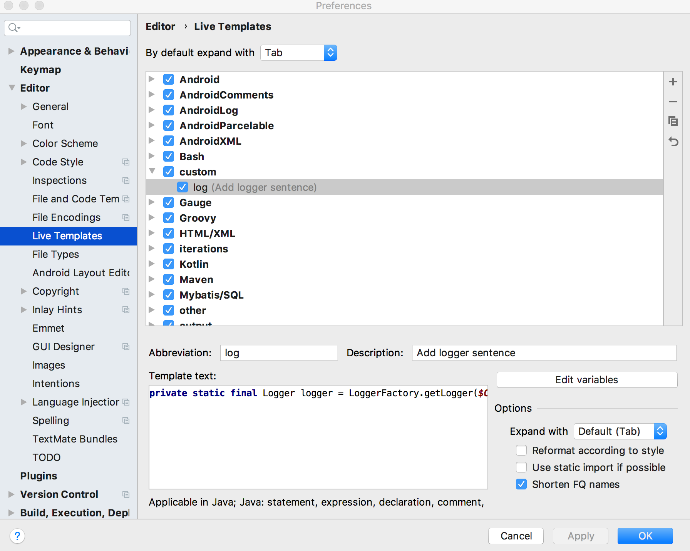
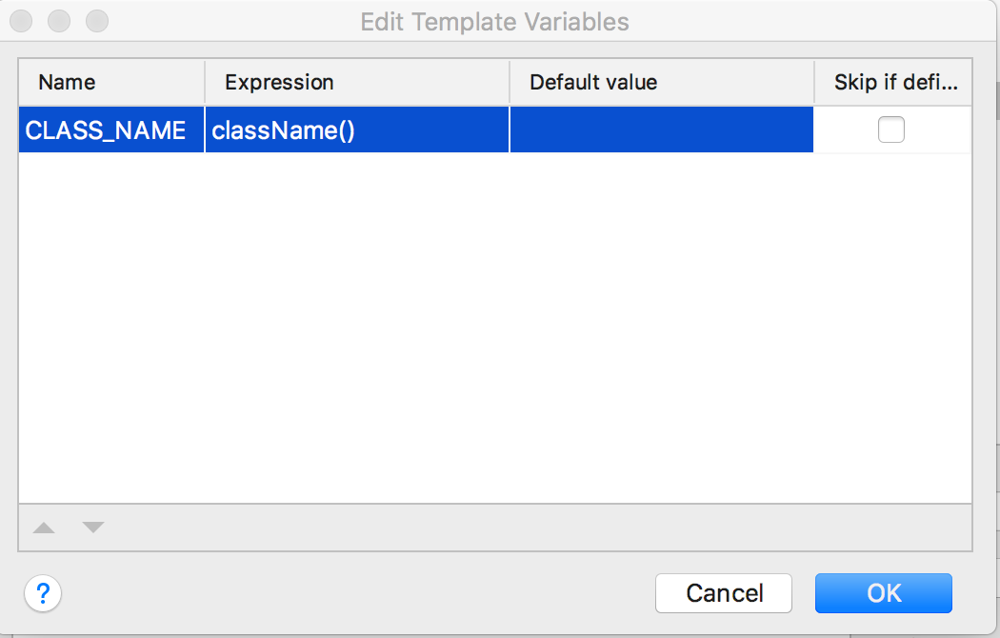
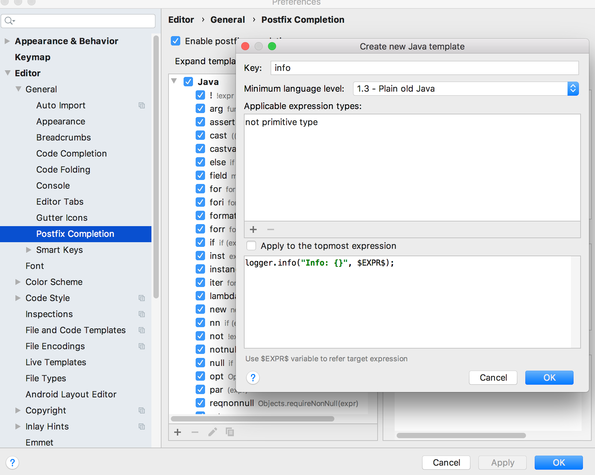

# 第4节：常用技巧

#### Maven/Gradle创建IDEA工程文件

Maven和Gradle都是Java的两大主流构建工具。

##### Maven生成IDEA工程文件

```shell
⇒ mvn -version
Apache Maven 3.5.2
⇒ mvn archetype:generate -DgroupId=com.learn.idea -DartifactId=maven-app -DarchetypeArtifactId=maven-archetype-quickstart -DarchetypeVersion=1.4 -DinteractiveMode=false
```

而后使用`mvn idea:idea`就可以创建IDEA的工程文件，最后，项目文件列表如：

```shell
├── maven-app.iml
├── maven-app.ipr
├── maven-app.iws
├── pom.xml
└── src
    ├── main
    │   └── java
    │       └── com
    │           └── learn
    │               └── idea
    │                   └── App.java
    └── test
        └── java
            └── com
                └── learn
                    └── idea
                        └── AppTest.java
```

双击打开`maven-app.ipr`后IDEA就自动导入了此项目。

##### Gradle 生成IDEA工程文件

```shell
⇒  gradle -v
Gradle 5.6.2
⇒  mkdir gradle-app
⇒  cd gradle-app
⇒  gradle init --type java-application --dsl groovy --package com.learn.idea --project-name gradle-app --test-framework junit-jupiter
```

修改`build.gradle`，在`plugins`里添加`id: 'idea'`：

```groovy
plugins {
    // Apply the java plugin to add support for Java
    id 'java'

    // Apply the application plugin to add support for building a CLI application
    id 'application'
    id 'idea'
}
```

而后`gradle idea`生成IDEA的工程文件。双击打开`gradle-app.ipr`后IDEA就自动导入了此项目。

#### 自定义代码模板

##### Live Template

`⌘,`|`Alt+Ctrl+S`打开`IDEA`设置界面，搜索`live templates`。



图片上右边的"+"号可以添加`Template Group`和新的`Live Template`。这里创建了一个`custom`的组，以及一个缩略词为`log`的模板：

```java
private static final org.apache.logging.log4j.Logger logger = org.apache.logging.log4j.LogManager.getLogger($CLASS_NAME$.class);
```

首先选择其范围为`Applicable in Java`，勾选`Shorten FQ Names`，而后`Edit Variables`，设置`CLASS_NAME`:



在实现代码`App`类中，输入`log`后按`Tab`键，则会自动生成`log`相关代码并会自动`import`相关依赖：

```java
import org.apache.logging.log4j.LogManager;
import org.apache.logging.log4j.Logger;

public class App {
    private static final Logger logger = LogManager.getLogger(App.class);
}
```

对于一些更特殊一些的模板，譬如将选中的代码使用模板代码包围起来，定义一个`info`模板：

```java
logger.info("Info: {}", $SELECTION$);
```

这里`$SELECTION$`表示选中的代码，在选中的某个变量后，按`⌘⌥T`|`Ctrl+Alt+T`后按会弹出列表提示，列表中`info`会给出一个快捷键，笔者的IDEA里是`i`，则按`I`键则可以生成代码如:

```java
logger.info("Info: {}", "some string");
```

##### Postfix Completion

笔者习惯于使用`"somestring".info`就能够生成`logger.info`语句，这就需要修改`Postfix Completion`，`⌘,`|`Alt+Ctrl+S`打开`IDEA`设置界面搜索`Postfix Completion`。设置如：



> `logger.info("Info: {}", $EXPR$);`这里的`$EXPR$`代表着`.info`之前的表达式。

##### File and Code Templates

另外`IDEA`也默认定义了很多模板用于支持创建文件/类等行为，这里将使得`IDEA`在创建类时添加`logger`相关代码，打开`IDEA`的配置搜索`File and Code Templates`后，选择`Files`标签页的`Class`：

```java
#if (${PACKAGE_NAME} && ${PACKAGE_NAME} != "")package ${PACKAGE_NAME};#end
#parse("File Header.java")
import org.apache.logging.log4j.Logger;
import org.apache.logging.log4j.LogManager;
public class ${NAME} {
    private static final Logger logger = LogManager.getLogger(${NAME}.class);
}
```

这样，在使用`IDEA`创建的新类都会自动添加`log4j2`的`import`语句以及在类中创建`logger`成员变量。


